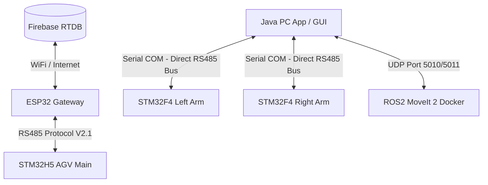

# TÀI LIỆU THUYẾT MINH & ĐẶC TẢ KỸ THUẬT HỆ THỐNG
## XE TỰ HÀNH AGV TÍCH HỢP CÁNH TAY ROBOT KÉP (DUAL-ARM HYBRID AGV SYSTEM)

Tài liệu này cung cấp toàn bộ thông tin chi tiết về kiến trúc phần cứng, cấu trúc phần mềm, giao thức truyền thông và hướng dẫn điều khiển của hệ thống xe tự hành AGV kết hợp hai cánh tay robot 6 trục (Dual-Arm). Hệ thống được thiết kế theo tiêu chuẩn công nghiệp nhằm phục vụ các tác vụ vận chuyển, gắp nhả vật tư tự động trong nhà máy thông minh.

---

## 1. TỔNG QUAN HỆ THỐNG (SYSTEM OVERVIEW)

Hệ thống được thiết kế dưới dạng kiến trúc phân tán (distributed architecture), bao gồm các phân hệ độc lập:
1. **Xe tự hành AGV**: Di chuyển bám vạch từ (Magnetic Line Following), định vị tọa độ bằng camera quét mã QR ngã tư (QR50) và la bàn điện tử (IMU), tự động tìm đường đi ngắn nhất bằng thuật toán Dijkstra.
2. **Cánh tay robot kép (Left & Right 6-DOF Arms)**: Hai cánh tay robot 6 trục đối xứng đảm nhận nhiệm vụ gắp nhả vật thể.
3. **Kiến trúc kết nối trực tiếp (Direct Communication Link)**:
   * **Xe AGV**: Trạng thái và điều khiển di chuyển được đồng bộ qua cổng RS485 Protocol V2.1 giữa **STM32H5 AGV Main** và **ESP32 Gateway** (để truyền lên cơ sở dữ liệu Firebase Realtime Database hoặc PC).
   * **Cánh tay Robot**: Ứng dụng **Java PC App** kết nối trực tiếp với 2 cánh tay robot qua cổng Serial (sử dụng bộ chuyển đổi USB-to-RS485 dùng chung một bus vật lý) bằng giao thức dạng Text có Checksum. Luồng dữ liệu điều khiển tay robot đi thẳng từ PC tới hai mạch điều khiển cánh tay (STM32F4) mà không thông qua bất kỳ bộ điều phối trung gian nào (như STM32H5 hay ESP32).
   * **Hoạch định quỹ đạo**: Bộ lập trình quỹ đạo MoveIt 2 (chạy trong Docker) nhận yêu cầu tọa độ XYZ từ Java PC App qua UDP port 5010 và trả về chuỗi quỹ đạo khớp qua UDP port 5011.



---

## 2. KIẾN TRÚC PHẦN CỨNG (HARDWARE ARCHITECTURE)

### 2.1. Phân Hệ Điều Khiển Di Chuyển AGV
* **Bo Mạch PLC-TVB-AIOT-STM32H5XX**: Tích hợp vi xử lý **STM32H563ZIT6** (ARM Cortex-M33, 250 MHz) đảm nhiệm bám vạch từ, đọc mã QR và rẽ ngã tư.
* **Gateway ESP32**: Đọc cảm biến định vị góc quay **IMU BNO055** và khoảng cách cản **VL53L5CX ToF** qua bus I2C, đồng thời giữ kết nối mạng đồng bộ với Firebase.

### 2.2. Phân Hệ Cánh Tay Robot Kép (Left & Right Arms)
* **Mạch điều khiển Arm Slave (STM32F446VET6)**: Mỗi cánh tay robot sở hữu một vi điều khiển STM32F446VET6 riêng biệt để xuất xung điều khiển Servo và đọc Encoder phản hồi vị trí.
* **Kết nối vật lý**: Cả hai cánh tay cùng kết nối chung vào bus truyền thông RS485 nối trực tiếp về PC. Máy tính PC sử dụng 1 cổng COM vật lý duy nhất (qua đầu chuyển USB-to-RS485) để gửi dữ liệu dạng Text cho cả hai tay. Hai tay robot phân biệt lệnh dành cho mình dựa vào tiền tố `R:` (Right) hoặc `L:` (Left).
* **Bộ kẹp vật thể (Gripper)**: Sử dụng cảm biến dòng điện kết hợp bộ chuyển đổi ADC 12-bit trên STM32F4. Khi kẹp vật thể, dòng điện động cơ tăng làm điện áp ADC thay đổi, giúp điều khiển vòng kín lực kẹp (Force Control) và tự động dừng kẹp khi đạt ngưỡng an toàn để tránh quá tải hoặc làm hỏng vật thể.

### 2.3. Thiết Kế Cơ Khí (CAD Mechanical Design)
Toàn bộ cấu trúc cơ khí của xe tự hành AGV và hệ thống hai cánh tay robot 6 trục được mô hình hóa, lắp ráp và mô phỏng động học trên phần mềm thiết kế 3D SolidWorks:
* **Cánh tay Robot 6 bậc tự do (6-DOF Arm)**: Thiết kế tối ưu hóa trọng lượng, phân bổ vật liệu hợp lý để tăng cường khả năng chịu tải cơ học. Chuyển động quay tại các khớp liên kết được thực hiện thông qua hệ thống bánh răng ăn khớp (bánh răng hành tinh, bánh răng thẳng trong/ngoài) truyền lực từ động cơ servo đầu vào để nhân mô-men xoắn.
* **Bộ kẹp cơ khí (Gripper Assembly)**: Sử dụng các chi tiết kẹp chuyển động đồng bộ để gắp, giữ và nhả vật phẩm một cách chính xác.
* **Xe tự hành AGV**: Khung gầm chịu lực chắc chắn, tích hợp các giá đỡ cảm biến từ, la bàn số IMU, camera quét mã QR và bệ đỡ chịu tải vững chắc cho hai cánh tay robot hoạt động đối xứng mà không làm lệch trọng tâm của xe.
* **Đồng bộ cơ - điện (CAD-PCB Co-design)**: Biên dạng hình học phẳng của bo mạch được xuất trực tiếp dưới dạng tệp vector DXF để làm khung viền (Outline) bo mạch trong Altium Designer, đảm bảo sự ăn khớp hoàn hảo giữa bo mạch điện tử với các lỗ vít định vị cơ khí và vỏ hộp bảo vệ.

### 2.4. Thiết Kế Mạch Điện Tử (PCB Schematic & Layout Design)
Mạch điều khiển cánh tay Arm Slave là bo mạch 2 lớp được thiết kế trên Altium Designer (tệp nguyên lý `arm.SchDoc` và bố trí linh kiện `arm.PcbDoc`):
* **Khối Vi điều khiển (MCU Block)**: Sử dụng chip **STM32F446VET6** gói chân LQFP100 (U2) với thạch anh ngoại 8 MHz (Y1), hỗ trợ giao tiếp nạp/gỡ lỗi qua cổng SWD.
* **Khối Cách ly Tín hiệu & Bảo vệ (Signal Isolation & Conditioning)**:
  * Cách ly tín hiệu xung xuất từ MCU đến Driver Servo và tín hiệu Encoder phản hồi bằng hệ thống Optocoupler tốc độ cao **6N137S** (U4, U5, U9, U10, U13, U14, U15, U16, U17, U18) để bảo vệ vi xử lý khỏi hiện tượng quá dòng ngược hoặc nhiễu điện áp cao từ động cơ.
  * IC đệm kích và lọc nhiễu hex Schmitt-trigger **74HC14D** (U6, U7, U8, U11, U12) giúp làm sạch răng cưa, ổn định dạng sóng vuông xung Encoder và khử nhiễu tín hiệu truyền dẫn khoảng cách xa.
* **Khối Quản lý Nguồn (Power Management)**:
  * Nguồn tổng DC 12V-24V đi qua mạch hạ áp Buck hiệu suất cao dùng IC ổn áp xung chịu dòng tải lớn **LM2576HVS-5.0V** (U3, gói chân TO263-5) để tạo nguồn logic 5V/3A.
  * Nguồn logic 3.3V cấp cho MCU được hạ áp từ nguồn 5V thông qua chip ổn áp tuyến tính LDO **AMS1117-3.3V** (AMS1, gói chân SOT223).
  * Khối RS485 và cổng cách ly opto sử dụng nguồn 5V cách ly độc lập tạo ra từ mô-đun nguồn DC-DC **B1205S-2WR3** (PS1, gói chân SIP-6, công suất 2W) để triệt tiêu hoàn toàn vòng lặp đất (Ground Loop) gây nhiễu tín hiệu serial.
* **Giao tiếp & IO ngoại vi**:
  * Kết nối UART USART2 (chân PA2/TX2, PA3/RX2 trên U2) đưa ra cổng RS485 cách ly kết nối trực tiếp về PC.
  * Hỗ trợ 2 cổng đọc ADC chuyên dụng (`vc1` trên chân PA6, `vc2` trên chân PB0) để thu thập dòng tải phục vụ thuật toán kẹp khép kín (Force control).
  * Hỗ trợ 5 nhóm đầu đọc Encoder (`E1` đến `E5`) và các chân Timer điều chế độ rộng xung PWM mở rộng (`TIM8`, `TIM9`, `TIM10`, `TIM11`, `TIM12`).

---

## 3. KIẾN TRÚC PHẦN MỀM & FIRMWARE (SOFTWARE & FIRMWARE)

### 3.1. Firmware Cánh Tay Robot (STM32F4 Arm Slave)
Trình điều khiển cánh tay Arm Slave xử lý ngắt nhận kí tự UART từ bus truyền thông RS485 và thực hiện bóc tách gói tin Text. Dưới đây là mã nguồn C triển khai trong ngắt nhận `HAL_UART_RxCpltCallback` của tệp `main.c` (STM32F4):

```c
void HAL_UART_RxCpltCallback(UART_HandleTypeDef *huart) {
  if (huart->Instance == USART2) {
    dbg_rx_raw_count++;
    uint8_t b = arm_rx_byte;
    dbg_rx_last_byte = b;

    // Tích lũy kí tự đến khi gặp ngắt dòng '\n' hoặc '\r'
    if (b == '\n' || b == '\r') {
      if (rx_index > 0) {
        rx_buffer[rx_index] = '\0';

        // Sao chép gói tin phục vụ gỡ lỗi
        strncpy((char *)dbg_rx_last_line, (char *)rx_buffer, sizeof(dbg_rx_last_line) - 1);
        dbg_rx_last_line[sizeof(dbg_rx_last_line) - 1] = '\0';
        dbg_rx_line_count++;

        // Xử lý trực tiếp lệnh điều khiển bộ kẹp (không cần checksum)
        if (strcmp((char *)rx_buffer, "R:GRIP") == 0 || strcmp((char *)rx_buffer, "L:GRIP") == 0) {
          gripper_state = GRIPPER_CLOSING;
          dbg_rx_ok++;
          rx_index = 0;
        } else if (strcmp((char *)rx_buffer, "R:RELEASE") == 0 || strcmp((char *)rx_buffer, "L:RELEASE") == 0) {
          gripper_state = GRIPPER_OPENING;
          dbg_rx_ok++;
          rx_index = 0;
        } else {
          // Kiểm tra và bóc tách XOR Checksum ký tự '*'
          char *star = strchr((char *)rx_buffer, '*');
          if (star != NULL) {
            *star = '\0';
            char *checksum_str = star + 1;

            // Tính XOR checksum của chuỗi trước ký tự '*'
            uint8_t calc_sum = 0;
            for (char *c_ptr = (char *)rx_buffer; c_ptr < star; c_ptr++) {
              calc_sum ^= (uint8_t)(*c_ptr);
            }

            unsigned int rx_sum = 0;
            if (sscanf(checksum_str, "%2X", &rx_sum) == 1) {
              if (calc_sum == (uint8_t)rx_sum) {
                // Hỗ trợ kiểm tra lệnh bộ kẹp đi kèm checksum
                if (strcmp((char *)rx_buffer, "R:GRIP") == 0 || strcmp((char *)rx_buffer, "L:GRIP") == 0) {
                  gripper_state = GRIPPER_CLOSING;
                  dbg_rx_ok++;
                } else if (strcmp((char *)rx_buffer, "R:RELEASE") == 0 || strcmp((char *)rx_buffer, "L:RELEASE") == 0) {
                  gripper_state = GRIPPER_OPENING;
                  dbg_rx_ok++;
                } else {
                  // Lọc tiền tố theo cài đặt biên dịch của cánh tay robot
#if defined(ARM_LEFT) || (ARM_PROTO_MY_ADDR == 0x02u)
                  const char *prefix = "L:";
#else
                  const char *prefix = "R:";
#endif
                  if (strncmp((char *)rx_buffer, prefix, 2) == 0) {
                    int q[6];
                    // Phân tích 6 góc khớp mục tiêu
                    if (sscanf((char *)rx_buffer + 2, "%d,%d,%d,%d,%d,%d", &q[0],
                               &q[1], &q[2], &q[3], &q[4], &q[5]) == 6) {
                      dbg_rx_ok++;
                      // Chuyển đổi và ánh xạ sang góc quay Servo vật lý
                      servo_deg[0] = -(float)q[0] / 100.0f + 96.43f;
                      servo_deg[1] = -(float)q[1] / 100.0f + 90.00f;
                      servo_deg[2] = (float)q[2] / 100.0f + 35.00f;
                      servo_deg[3] = 65.0f - (float)q[3] / 100.0f;
                      servo_deg[4] = -(float)q[4] / 100.0f + 90.00f;
                      servo_deg[5] = (float)q[5] / 100.0f;
                    } else {
                      dbg_rx_len++;
                    }
                  } else {
                    dbg_rx_bad_prefix++;
                  }
                }
              } else {
                dbg_rx_crc++; // Lỗi checksum
              }
            } else {
              dbg_rx_bad_hex++;
            }
          } else {
            dbg_rx_no_star++;
          }
          rx_index = 0;
        }
      }
    } else {
      if (rx_index < sizeof(rx_buffer) - 1) {
        rx_buffer[rx_index++] = b;
      } else {
        rx_index = 0;
      }
    }

    // Tiếp tục kích hoạt nhận ngắt UART 1 byte tiếp theo
    if (HAL_UART_Receive_IT(&huart2, &arm_rx_byte, 1) != HAL_OK) {
      HAL_UART_AbortReceive(&huart2);
      HAL_UART_Receive_IT(&huart2, &arm_rx_byte, 1);
    }
  }
}
```

> [!NOTE]
> **Bộ bảo vệ nhị phân V2.1 không kích hoạt:**
> Trong tệp `arm_protocol.c`, mặc dù có sẵn hàm `ARM_Proto_ProcessFrame()` thực hiện kiểm lỗi CRC-16 và bộ lọc giới hạn góc $\Delta\theta$ guard tối đa $3.00^\circ$ cho mỗi khung truyền ở tần số 50Hz, nhưng nó **không được sử dụng** trong hàm callback ngắt nhận thực tế của cánh tay robot. Hệ thống hiện tại nhận lệnh chuyển động trực tiếp thông qua cơ chế phân tích chuỗi Text (ASCII) trong hàm `HAL_UART_RxCpltCallback` ở trên.

### 3.2. Firmware AGV Main (STM32H5)
Mạch điều khiển chính STM32H5 quản lý các chế độ chạy của xe tự hành bằng một máy trạng thái (State machine) được định nghĩa qua kiểu liệt kê `AGV_RunMode_t` trong tệp `agv_control.h`:

```c
typedef enum {
    MODE_1_LINE_ONLY = 1,             // Chỉ bám vạch từ PID, bỏ qua ngã tư
    MODE_2_LINE_INTERSECTION = 2,     // Bám vạch và dừng phanh cứng tại ngã tư
    MODE_3_TEST_SENSORS_NO_MOTOR = 3, // Chạy định lý nhưng ngắt động cơ để test cảm biến
    MODE_4_FULL_RUN = 4,              // Vận hành tự động hoàn toàn (Dijkstra + Đọc QR + Rẽ ngã tư)
    MODE_5_CALIBRATE_MOTORS = 5,      // Căn chỉnh động cơ trái/phải theo chu kỳ
    MODE_6_TEST_TURN_RIGHT = 6,       // Gặp ngã tư tự động rẽ phải để kiểm tra cơ cấu
    MODE_7_DEBUG_NO_QR = 7,           // Chạy bám vạch và rẽ ngã tư không cần quét mã QR
    MODE_8_TEST_ENCODER = 8           // Chế độ kiểm tra phản hồi xung Encoder động cơ
} AGV_RunMode_t;
```

Thuật toán bám vạch từ PID và phân phối tốc độ động cơ điều khiển di chuyển được triển khai trong tệp `agv_control.c`:

```c
void AGV_FollowLine(AGV_HandleTypeDef *hagv) {
  if (hagv == NULL) return;

  static uint32_t lost_line_time = 0;
  uint16_t line_val = LineSensor_Read(hagv->line_sensor);

  // Xử lý khi xe lệch hoàn toàn khỏi vạch từ (mất line)
  if (line_val == 0xFFFF || line_val == 0x0000) {
    if (lost_line_time == 0) lost_line_time = HAL_GetTick();
    if (HAL_GetTick() - lost_line_time > 10000) {
      if (agv_state.run_mode == MODE_4_FULL_RUN) {
        agv_state.follow_line_enable = false;
        agv_state.indicator_state = 3; // Chuyển trạng thái sang báo lỗi (State 3)
      }
      AGV_Stop(hagv);
    }
    return;
  } else {
    lost_line_time = 0;
  }

  // Nhận diện ngã tư (Intersection): Mắt biên trái/phải đè vạch đồng thời mắt giữa bám vạch
  if (agv_state.run_mode != MODE_1_LINE_ONLY && agv_state.run_mode != MODE_3_TEST_SENSORS_NO_MOTOR) {
    if (((line_val & 0x8001) != 0x8001) && ((line_val & CENTER_MASK) != CENTER_MASK) &&
        (HAL_GetTick() - agv_state.last_leave_intersection_time > AGV_LINE_RECOVERY_TIME)) {
      AGV_Stop(hagv);
      agv_state.follow_line_enable = false;
      agv_state.is_at_intersection = true;
      agv_state.intersection_time = HAL_GetTick();
      return;
    }
  }

  // Đọc góc lệch và tính toán điều khiển PID
  hagv->current_error = AGV_GetLineError(line_val, hagv->current_error);
  hagv->pid_controller->current_val = hagv->current_error;
  float output = AGV_ComputePID(hagv->pid_controller, 0.0f);

  // Ramping tăng giảm tốc mềm mại tránh giật xe
  float accel_step = 2.5f; 
  if (hagv->current_speed < hagv->base_speed) {
    hagv->current_speed += accel_step;
    if (hagv->current_speed > hagv->base_speed) hagv->current_speed = hagv->base_speed;
  } else if (hagv->current_speed > hagv->base_speed) {
    hagv->current_speed -= accel_step;
    if (hagv->current_speed < hagv->base_speed) hagv->current_speed = hagv->base_speed;
  }

  // Điều khiển bánh xe theo chiều di chuyển
  if (hagv->direction == 1) { // Tiến
    int16_t speed_l = (int16_t)(hagv->current_speed - output);
    int16_t speed_r = (int16_t)(hagv->current_speed + output);

    if (speed_l > 999) speed_l = 999;
    if (speed_r > 999) speed_r = 999;
    if (speed_l < -300) speed_l = -300;
    if (speed_r < -300) speed_r = -300;

    if (agv_state.run_mode != MODE_3_TEST_SENSORS_NO_MOTOR) {
      Motor_SetSpeed(hagv->motor_left, speed_l);
      Motor_SetSpeed(hagv->motor_right, speed_r);
    }
  } else if (hagv->direction == -1) { // Lùi
    // Đảo dấu logic PID khi đi lùi vì cảm biến nằm ở đầu xe
    int16_t speed_l = (int16_t)(-hagv->current_speed + output);
    int16_t speed_r = (int16_t)(-hagv->current_speed - output);

    if (speed_l < -999) speed_l = -999;
    if (speed_r < -999) speed_r = -999;
    if (speed_l > 300) speed_l = 300;
    if (speed_r > 300) speed_r = 300;

    if (agv_state.run_mode != MODE_3_TEST_SENSORS_NO_MOTOR) {
      Motor_SetSpeed(hagv->motor_left, speed_l);
      Motor_SetSpeed(hagv->motor_right, speed_r);
    }
  }
}
```

### 3.3. Ứng Dụng Java PC App (Swing GUI)
Ứng dụng PC đóng vai trò gửi trực tiếp góc khớp robot dạng Text xuống bus RS485. Trong class `MainFrame.java`, hàm `sendJointsToUart` thực hiện dịch chuyển đổi góc sang hệ tọa độ cơ cấu chấp hành tương đối so với Home và định dạng khung truyền:

```java
    private void sendJointsToUart(boolean forceSend) {
        if (!armStreamingEnabled) {
            return;
        }

        boolean uartConnected = uartManager != null && uartManager.isConnected();
        if (!uartConnected) {
            return;
        }

        boolean rightChanged = forceSend;
        boolean leftChanged = forceSend;

        // So sánh góc hiện tại với góc gửi gần nhất để phát hiện thay đổi
        if (!forceSend) {
            for (int i = 0; i < NUM_JOINTS; i++) {
                if (Math.abs(anglesRight[i] - lastSentAnglesRight[i]) > 0.01) {
                    rightChanged = true;
                }
                if (Math.abs(anglesLeft[i] - lastSentAnglesLeft[i]) > 0.01) {
                    leftChanged = true;
                }
            }
        }

        // --- Gửi dữ liệu tay Phải ---
        if (rightChanged) {
            double[] qActuator = toHomeRelativeActuatorSpace(anglesRight, true);

            // Format dạng chuỗi: R:dq0,dq1,dq2,dq3,dq4,dq5 (góc thực * 100)
            String textFrame = String.format(java.util.Locale.US, "R:%d,%d,%d,%d,%d,%d",
                (int) Math.round(qActuator[0] * 100.0),
                (int) Math.round(qActuator[1] * 100.0),
                (int) Math.round(qActuator[2] * 100.0),
                (int) Math.round(qActuator[3] * 100.0),
                (int) Math.round(qActuator[4] * 100.0),
                (int) Math.round(qActuator[5] * 100.0));

            String frameWithChecksum = addChecksum(textFrame);

            if (txUartRight != null) {
                txUartRight.setText(frameWithChecksum.trim());
            }
            uartManager.sendData(frameWithChecksum);
            System.arraycopy(anglesRight, 0, lastSentAnglesRight, 0, NUM_JOINTS);
        }

        // --- Gửi dữ liệu tay Trái ---
        if (leftChanged) {
            double[] qActuator = toHomeRelativeActuatorSpace(anglesLeft, false);

            String textFrame = String.format(java.util.Locale.US, "L:%d,%d,%d,%d,%d,%d",
                (int) Math.round(qActuator[0] * 100.0),
                (int) Math.round(qActuator[1] * 100.0),
                (int) Math.round(qActuator[2] * 100.0),
                (int) Math.round(qActuator[3] * 100.0),
                (int) Math.round(qActuator[4] * 100.0),
                (int) Math.round(qActuator[5] * 100.0));

            String frameWithChecksum = addChecksum(textFrame);

            if (txUartLeft != null) {
                txUartLeft.setText(frameWithChecksum.trim());
            }
            uartManager.sendData(frameWithChecksum);
            System.arraycopy(anglesLeft, 0, lastSentAnglesLeft, 0, NUM_JOINTS);
        }
    }
```

Hàm `addChecksum` thực hiện phép XOR từng kí tự trong chuỗi góc và trả về định dạng kèm mã hex 2 kí tự viết hoa:

```java
    private String addChecksum(String str) {
        String content = str.trim();
        int sum = 0;
        for (int i = 0; i < content.length(); i++) {
            sum ^= content.charAt(i);
        }
        return content + "*" + String.format("%02X", sum & 0xFF) + "\n";
    }
```

### 3.4. Hệ Thống ROS2 & MoveIt 2 (Docker Container)
Bộ cầu nối UDP-ROS2 trong tệp `java_udp_bridge.py` đóng vai trò đồng bộ hóa yêu cầu hoạch định quỹ đạo từ Java App sang ROS2. Dưới đây là các hàm cốt lõi quản lý kết nối và điều phối thông điệp:

```python
    def poll_socket(self):
        # Dọn dẹp các yêu cầu cũ bị timeout (> 10.0 giây)
        now = time.time()
        stale_ids = [rid for rid, (_, _, _, _, t) in self.pending_requests.items() if now - t > 10.0]
        for rid in stale_ids:
            sender_host, sender_port, reply_host, reply_port, _ = self.pending_requests.pop(rid)
            target_host = sender_host if sender_host else reply_host
            target_port = sender_port if sender_port else reply_port
            timeout_response = {
                "type": "plan_response",
                "request_id": rid,
                "ok": False,
                "error": "Planning timeout from ROS 2 backend",
                "stamp": now,
            }
            try:
                self.socket.sendto(json.dumps(timeout_response).encode("utf-8"), (target_host, target_port))
            except Exception:
                pass

        # Đọc dữ liệu từ Socket không chặn (non-blocking)
        while True:
            try:
                data, address = self.socket.recvfrom(65535)
                self.get_logger().info(f"Received UDP packet from {address}")
            except BlockingIOError:
                return
            except OSError as exc:
                self.get_logger().error(f"UDP receive failed: {exc}")
                return

            try:
                request = json.loads(data.decode("utf-8"))
                self.get_logger().info(f"Parsed request: {request}")
                response = self.handle_request(request, address)
                if response is None:
                    continue
            except Exception as exc:
                response = {
                    "type": "plan_response",
                    "ok": False,
                    "error": str(exc),
                    "stamp": time.time(),
                }

            reply_host = response.pop("_reply_host", address[0])
            reply_port = int(response.pop("_reply_port", self.default_reply_port))
            self.socket.sendto(json.dumps(response).encode("utf-8"), (reply_host, reply_port))

    def handle_request(self, request, address):
        request_id = request.get("request_id") or str(uuid.uuid4())
        request["request_id"] = request_id
        request.setdefault("received_from", {"host": address[0], "port": address[1]})
        request.setdefault("stamp", time.time())

        reply_host = request.get("reply_host", self.default_reply_host)
        reply_port = int(request.get("reply_port", self.default_reply_port))
        
        # Xử lý nhanh tin nhắn kiểm tra kết nối ping
        if request.get("type") == "ping":
            return {
                "type": "pong",
                "request_id": request_id,
                "ok": True,
                "stamp": time.time(),
                "_reply_host": address[0],
                "_reply_port": address[1],
            }

        # Lưu lại thông tin socket để phản hồi sau khi MoveIt lập xong quỹ đạo
        self.pending_requests[request_id] = (address[0], address[1], reply_host, reply_port, time.time())

        # Xuất bản yêu cầu sang topic ROS2
        msg = String()
        msg.data = json.dumps(request)
        self.publisher.publish(msg)
        return None
```

---

## 4. GIAO THỨC TRUYỀN THÔNG (COMMUNICATION PROTOCOLS)

Mạng truyền thông của hệ thống được chia làm 2 giao thức riêng biệt:

### 4.1. Giao Thức Điều Khiển Cánh Tay Robot (PC $\rightarrow$ Arms)
Sử dụng định dạng chuỗi ký tự mã hóa Text truyền trên đường bus RS485 tốc độ **115200 bps**.

#### 4.1.1. Lệnh Góc Khớp (Joint Command Frame)
* **Cú pháp**: `[Tiền_tố][dq0],[dq1],[dq2],[dq3],[dq4],[dq5]*[XOR_Checksum]\n`
* **Ý nghĩa thành phần**:
  * `Tiền_tố`: `R:` dành cho tay phải, `L:` dành cho tay trái.
  * `dq0` đến `dq5`: Góc lệch tương đối của 6 khớp so với vị trí Home cơ khí, biểu diễn bằng giá trị góc thực nhân với 100 và làm tròn thành số nguyên (`độ * 100`).
  * `*`: Ký tự phân tách dữ liệu và mã kiểm lỗi checksum.
  * `XOR_Checksum`: 2 ký tự hệ Hex (viết hoa) là kết quả phép XOR từng byte của toàn bộ chuỗi ký tự đứng trước dấu `*`.
  * `\n`: Ký tự xuống dòng đánh dấu kết thúc frame truyền.
* **Ví dụ thực tế**: `R:0,0,1000,-3000,0,0*5A\n`

#### 4.1.2. Lệnh Bộ Kẹp (Gripper Command Frame)
Bộ kẹp vật thể được điều khiển đóng mở trực tiếp bằng các chuỗi lệnh không cần tham số góc khớp:
* `R:GRIP` hoặc `L:GRIP`: Đóng kẹp tay phải / tay trái (kích hoạt trạng thái kẹp dòng đóng).
* `R:RELEASE` hoặc `L:RELEASE`: Mở kẹp tay phải / tay trái.
*(Có thể truyền kèm mã checksum tùy chọn hoặc kiểm tra chuỗi tĩnh trực tiếp trong firmware)*.

### 4.2. Giao Thức Di Chuyển AGV (ESP32 $\leftrightarrow$ STM32H5 Main)
Sử dụng giao thức nhị phân **Protocol V2.1** truyền trên đường truyền UART nội bộ xe tự hành:
* **Cơ chế**: Gói tin nhị phân tối ưu hóa Little-Endian có độ dài payload linh hoạt và bảo vệ bằng mã CRC-16/CCITT-FALSE.
* **Cấu trúc**: `[0xAA][0x55][DEST][SRC][LEN_L][LEN_H][CMD][SEQ][PAYLOAD...][CRC_L][CRC_H]`.

---

## 5. HƯỚNG DẪN VẬN HÀNH & ĐIỀU KHIỂN (OPERATING & CONTROL GUIDE)

### 5.1. Kết Nối Thiết Bị
1. Cắm bộ chuyển đổi **USB-to-RS485** từ máy tính PC điều khiển vào đường bus RS485 nối trực tiếp đến hai cánh tay robot (STM32F4).
2. Bật nguồn cấp cho hệ thống xe tự hành và cánh tay robot.
3. Trên máy tính PC, kiểm tra cổng COM nhận được của bộ chuyển đổi (ví dụ: `COM3` trên Windows hoặc `/dev/ttyUSB0` trên Linux).

### 5.2. Khởi Chạy Và Kết Nối Trên Java PC App
1. Khởi động ứng dụng bằng file `run.bat` hoặc `./run.sh`.
2. Trên thanh menu hoặc bảng điều khiển kết nối, chọn đúng tên cổng COM của USB-to-RS485.
3. Thiết lập tốc độ Baudrate là **115200**.
4. Nhấn **Connect**. Khi kết nối thành công, ứng dụng sẽ bắt đầu truyền các chuỗi lệnh text bám sát sự thay đổi thanh trượt góc khớp (FK) hoặc tọa độ XYZ (IK).

### 5.3. Sử Dụng Tay Cầm PS5 & Hoạch Định Quỹ Đạo ROS2
* Chạy mã nguồn Python `scripts/requirements.txt` và khởi chạy kịch bản ánh xạ nút tay cầm để điều khiển tay qua cổng COM trực tiếp.
* Khởi động Docker Compose để kết nối với MoveIt 2 lập kế hoạch quỹ đạo không va chạm, gửi nhận dữ liệu tọa độ qua UDP nội bộ máy tính trước khi chuyển đổi thành chuỗi lệnh text truyền ra cổng COM.
