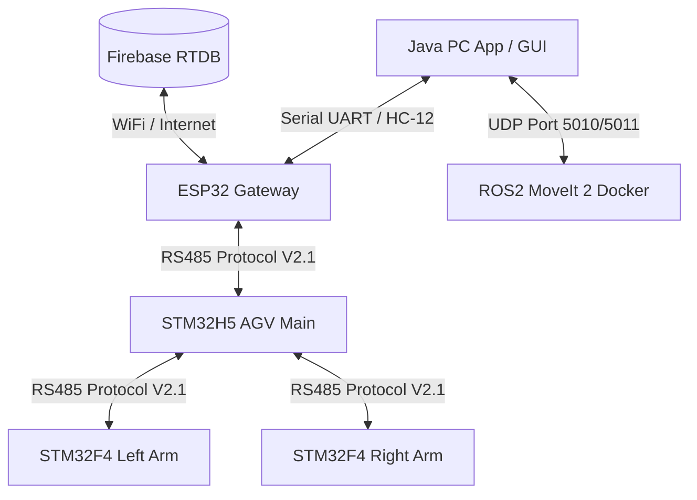
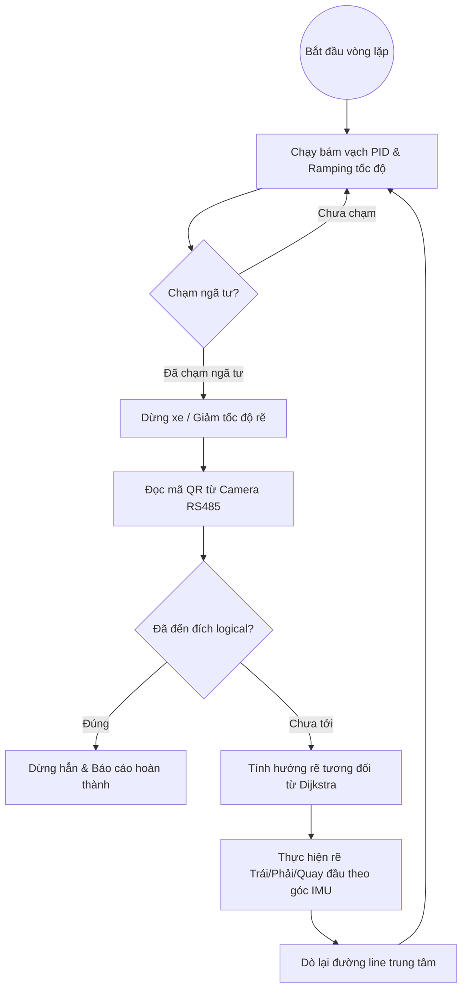

# TÀI LIỆU THUYẾT MINH & ĐẶC TẢ KỸ THUẬT HỆ THỐNG
## XE TỰ HÀNH AGV TÍCH HỢP CÁNH TAY ROBOT KÉP (DUAL-ARM HYBRID AGV SYSTEM)

Tài liệu này cung cấp toàn bộ thông tin chi tiết về kiến trúc phần cứng, cấu trúc phần mềm, giao thức truyền thông và hướng dẫn điều khiển của hệ thống xe tự hành AGV kết hợp hai cánh tay robot 6 trục (Dual-Arm). Hệ thống được thiết kế theo tiêu chuẩn công nghiệp nhằm phục vụ các tác vụ vận chuyển, gắp nhả vật tư tự động trong nhà máy thông minh.

---

## 1. TỔNG QUAN HỆ THỐNG (SYSTEM OVERVIEW)

Hệ thống là sự kết hợp lai (hybrid) giữa:
1. **Xe tự hành AGV**: Di chuyển bám vạch từ (Magnetic Line Following), định vị tọa độ bằng camera quét mã QR ngã tư (QR50) và la bàn điện tử (IMU), tự động tìm đường đi ngắn nhất bằng thuật toán Dijkstra.
2. **Cánh tay robot kép (Left & Right 6-DOF Arms)**: Hai cánh tay robot 6 trục đối xứng đảm nhận nhiệm vụ gắp nhả vật thể.
3. **Hệ thống điều phối trung tâm**: Bao gồm Gateway ESP32 kết nối cơ sở dữ liệu Firebase Realtime Database (RTDB), ứng dụng PC điều khiển (Java Swing GUI) tích hợp giải thuật động học ngược (Inverse Kinematics) hiệu năng cao qua JNI, và bộ lập trình quỹ đạo chuyển động nâng cao ROS2/MoveIt 2 chạy trong môi trường Docker.



---

## 2. KIẾN TRÚC PHẦN CỨNG (HARDWARE ARCHITECTURE)

### 2.1. Bo Mạch Điều Khiển Trung Tâm AGV (PLC-TVB-AIOT-STM32H5XX)
Hệ thống sử dụng bo mạch điều khiển công nghiệp tích hợp vi xử lý **STM32H563ZIT6** (ARM Cortex-M33, xung nhịp lên tới 250 MHz), được thiết kế cách ly hoàn toàn chống nhiễu:

| Thành phần ngoại vi | Thông số kỹ thuật & Chi tiết kết nối |
| :--- | :--- |
| **Vi điều khiển (MCU)** | STM32H563ZIT6, hiệu năng cao, tích hợp phần cứng bảo mật TrustZone |
| **Nguồn cấp (Power)** | 9V - 36VDC / 2A cách ly; đầu ra 5V cấp nguồn cho linh kiện ngoài |
| **Đường truyền (Interfaces)** | 3x RS485 cách ly (RS485_0: PC10/PC11; RS485_1: PD5/PD6; RS485_2: PC12/PD2)<br>1x RS232 cách ly (PA9/PA10)<br>1x Ethernet RJ45 qua chip W5500 (SPI) |
| **I/O Mở rộng** | **38x Digital Inputs** (cấu hình PNP/NPN qua Jumper J7)<br>**24x Relay Outputs** (Y0-Y23 điều khiển ngoại vi)<br>**2x DAC 16-bit** (SPI DAC8852, ngõ ra 0-10V)<br>**8x ADC 16-bit** (SPI ADS8688, ngõ vào 0-5V/0-10V)<br>**4x Hardware Encoder** (SPI LS7366R đọc vị trí bánh xe)<br>**8x PWM Channels** (điều khiển driver động cơ/servo) |

### 2.2. Cơ Cấu Cánh Tay Robot Kép (Left & Right Arms)
* **Bậc tự do (DOF)**: 6 trục chuyển động cho mỗi cánh tay, sử dụng các động cơ Servo góc quay lớn.
* **Mạch điều khiển Arm Slave**: Mỗi cánh tay được trang bị một mạch vi điều khiển **STM32F446VET6** để điều khiển trực tiếp các kênh PWM Servo và đọc tín hiệu phản hồi từ Encoder tương ứng.
* **Bộ kẹp vật thể (Gripper)**: Sử dụng cảm biến dòng điện kết hợp bộ chuyển đổi ADC 12-bit trên STM32F4. Khi kẹp vật thể, dòng điện động cơ tăng làm điện áp ADC thay đổi, giúp điều khiển vòng kín lực kẹp (Force Control) và tự động dừng kẹp khi đạt ngưỡng an toàn để tránh quá tải hoặc làm hỏng vật thể.

### 2.3. Cảm Biến Và Kết Nối Ngoại Vi
* **Định vị góc quay (IMU)**: Sử dụng cảm biến **BNO055** kết nối qua I2C của ESP32. Dữ liệu góc Yaw được ESP32 gửi về STM32H5 để hiệu chỉnh hướng di chuyển của AGV theo thời gian thực.
* **Cảm biến tránh vật cản (ToF)**: Cảm biến LiDAR siêu âm **VL53L5CX** (quét ma trận 8x8 vùng) hoặc **VL53L1X** gửi khoảng cách vật cản gần nhất về cho xe giảm tốc hoặc dừng khẩn cấp.
* **Mắt đọc mã QR (QR50)**: Đọc các thẻ mã QR dán tại ngã tư giao lộ sa bàn thông qua đường truyền RS485.

---

## 3. KIẾN TRÚC PHẦN MỀM & FIRMWARE (SOFTWARE & FIRMWARE)

### 3.1. Firmware AGV Main (STM32H5)
Viết bằng C chuẩn (HAL Library), sử dụng cơ chế DMA nhận truyền UART không chặn (non-blocking circular DMA) và ngắt thời gian thực.
* **Hệ thống 7 chế độ vận hành (AGV Run Modes)**:
  1. `MODE_1_LINE_ONLY`: Chỉ bám vạch từ PID, bỏ qua ngã tư và QR. Dùng để cấu hình Kp, Ki, Kd.
  2. `MODE_2_LINE_INTERSECTION`: Bám vạch và dừng phanh cứng khi chạm mắt rìa ngã tư để đo cơ khí.
  3. `MODE_3_TEST_SENSORS_NO_MOTOR`: Ngắt động cơ, chạy thuật toán định tuyến để đẩy xe bằng tay test cảm biến.
  4. `MODE_4_FULL_RUN`: Tự động hoàn toàn (Dijkstra + Đọc QR + Rẽ ngã tư + Truyền thông).
  5. `MODE_5_CALIBRATE_MOTORS`: Chạy tiến/lùi/rẽ theo chu kỳ thời gian để căn chỉnh phần cứng bánh xe.
  6. `MODE_6_TEST_TURN_RIGHT`: Chạy bám vạch, cứ gặp ngã tư bất kỳ là tự động rẽ phải.
  7. `MODE_7_DYNAMIC_TRAJECTORY` (**Quỹ đạo động từ Firebase**): Khi nhận tọa độ đích mới từ Firebase qua ESP32, xe tính lại lộ trình bằng thuật toán Dijkstra và "nối" lệnh bẻ lái trực tiếp tại ngã tư tiếp theo mà không cần dừng xe lại.
* **Thuật toán bám vạch (Line Following)**: Quét 16 mắt từ, ghép thành biến nhị phân 16-bit (ví dụ: `0xFC3F`), tính toán sai lệch góc (Line Error từ -4.0 đến 4.0) và chạy bộ lọc PID điều khiển tốc độ hai bánh trái/phải với cơ chế tăng tốc mềm mại (Speed Ramping).
* **Định vị & Bẻ lái (Turn Logic)**: Hỗ trợ bẻ lái theo thời gian (Time-based) và bẻ lái theo góc IMU (IMU-based). Xe sẽ tự động kiểm tra góc quay thực tế từ IMU thông qua hàm `AGV_ValidateHeading()` để bù sai số trượt bánh.



### 3.2. Firmware Cánh Tay Robot (STM32F4 Arm Slave)
* **Parser Giao thức V2.1**: Nhận dạng frame nhị phân tốc độ cao, trích xuất góc khớp mục tiêu dưới dạng số nguyên 16-bit (`độ * 100`).
* **Hàm chuyển đổi góc vật lý**:
  Các góc khớp logic được dịch thành góc quay servo thực tế bằng các công thức tuyến tính đã được hiệu chỉnh cơ khí:
  * Khớp 1: $Servo_0 = -q_1 + 96.43^\circ$
  * Khớp 2: $Servo_1 = -q_2 + 90.00^\circ$
  * Khớp 3: $Servo_2 = q_3 + 35.00^\circ$
  * Khớp 4: $Servo_3 = 65.00^\circ - q_4$
  * Khớp 5: $Servo_4 = -q_5 + 90.00^\circ$
  * Khớp 6 (Kẹp): $Servo_5 = gripper\_angle$ (Điều khiển vòng kín ADC bảo vệ dòng)
* **Cơ chế Bảo vệ Gia tốc Khớp ($\Delta\theta$ Guard)**:
  Để tránh tình trạng cánh tay bị giật mạnh gây gãy bánh răng cơ khí khi nhận xung nhiễu hoặc sai lệch quỹ đạo đột ngột, firmware tích hợp bộ giám sát chênh lệch góc giữa hai chu kỳ liên tiếp:
  $$\Delta \theta_i = |q_{new, i} - q_{last, i}|$$
  Nếu tồn tại bất kỳ khớp nào có $\Delta \theta_i > max\_delta\_x100$ (thường đặt ở mức $3.0^\circ$ tại tần số truyền 50Hz), Arm Slave sẽ **hủy bỏ (drop) toàn bộ frame** đó và giữ nguyên vị trí an toàn cũ, đồng thời phản hồi mã lỗi `NACK_JOINT_DELTA_EXCEEDED` (0x06).

### 3.3. Firmware ESP32 Gateway & Sensor Hub
Sử dụng hệ điều hành thời gian thực FreeRTOS đa nhiệm chạy song song hai nhân (Dual-Core):
* **Nhân 0 (Core 0 - Firebase Task)**: Chuyên trách giữ kết nối WiFi và thực hiện truy vấn HTTP/REST Client đến Firebase Realtime Database. Tách luồng này giúp loại bỏ hoàn toàn độ trễ mạng (Network Latency), không gây treo hệ thống điều khiển cơ học.
* **Nhân 1 (Core 1 - Control Loop)**: Chạy vòng lặp điều khiển thời gian thực chu kỳ cao, đọc dữ liệu góc nghiêng từ cảm biến IMU BNO055 và VL53L5CX, đồng thời đóng gói dữ liệu truyền về STM32 qua cổng UART RS485 tốc độ 115200 bps.

### 3.4. Ứng Dụng PC Điều Khiển (Java Swing GUI)
* **Mô phỏng 3D thời gian thực**: Vẽ khung dây (wireframe) 3D mô phỏng góc khớp của hai tay để người vận hành kiểm tra va chạm trước khi xuất lệnh xuống xe thực tế.
* **Bộ giải Động học Ngược JNI (C++ Solver via JNI)**:
  Để giải phương trình động học ngược (IK) cho cánh tay 6 bậc tự do trong thời gian thực tại tần số 50Hz, ứng dụng sử dụng thư viện động liên kết C++ (`kinematics_jni.dll` trên Windows hoặc `libkinematics_jni.so` trên Ubuntu) qua giao tiếp Java Native Interface (JNI). Bộ giải số học C++ này cho tốc độ tính toán nhanh gấp hàng trăm lần so với viết bằng Java thuần, đảm bảo quỹ đạo TCP (Tool Center Point) chuyển động trơn tru.
* **Hỗ trợ tay cầm điều khiển PS5**: Tích hợp mã nguồn Python phụ trợ sử dụng thư viện `pygame` để ánh xạ các nút nhấn và cần gạt trên tay cầm PS5 thành lệnh di chuyển XYZ và góc quay của gripper.

### 3.5. Hệ Thống ROS2 & MoveIt 2 (Docker Container)
Dành cho các tác vụ lập kế hoạch quỹ đạo phức tạp có tránh vật cản động:
* **Môi trường**: Container Docker chạy hệ điều hành Ubuntu cài sẵn ROS2 (Jazzy) và MoveIt 2.
* **Ràng buộc hướng kẹp (Orientation Constraints)**: Trong file hoạch định `moveit_planner.cpp`, thuật toán lập quỹ đạo tích hợp ràng buộc hướng (Orientation Constraint) cho gripper của tay phải và tay trái:
  * Cho phép tự do xoay trục Yaw (xoay quanh trục đứng để ôm vật thể).
  * Khóa chặt góc Pitch và Roll (sai số cho phép $< 2.8^\circ$).
  * Điều này đảm bảo trong quá trình di chuyển gắp đặt vật phẩm (ví dụ: gắp cốc nước hoặc khay linh kiện giữa các ghế thí nghiệm), bộ kẹp luôn giữ song song với mặt đất, tránh làm rơi đổ vật phẩm.
* **Cầu nối Java-UDP Bridge (`java_udp_bridge.py`)**: Lắng nghe các gói tin JSON chứa tọa độ đích XYZ từ Java App gửi qua cổng UDP `5010`, chuyển tiếp vào topic `/agv_arm/plan_requests` của ROS2, nhận quỹ đạo MoveIt đã tính toán và gửi phản hồi ngược lại Java App qua cổng UDP `5011`.

---

## 4. GIAO THỨC TRUYỀN THÔNG (COMMUNICATION PROTOCOL V2.1)

Hệ thống sử dụng chung một giao thức khung truyền nhị phân (Binary Frame) thống nhất cho tất cả các node trong mạng RS485 để tối ưu hóa băng thông truyền dẫn tại tần số 50 Hz.

### 4.1. Cấu Trúc Khung Truyền (Frame Format)
Một gói tin hoàn chỉnh bao gồm 10 byte header/footer cố định và phần Payload biến thiên:

| Byte Offset | Trường dữ liệu | Giá trị / Ý nghĩa |
| :--- | :--- | :--- |
| `[0]` | SOF1 | `0xAA` (Start of Frame 1) |
| `[1]` | SOF2 | `0x55` (Start of Frame 2) |
| `[2]` | DEST | Địa chỉ Node nhận lệnh |
| `[3]` | SRC | Địa chỉ Node gửi lệnh |
| `[4]` | LEN_L | Byte thấp của độ dài Payload |
| `[5]` | LEN_H | Byte cao của độ dài Payload |
| `[6]` | CMD | Mã lệnh (Command ID) |
| `[7]` | SEQ | Số thứ tự gói tin (0 - 255) |
| `[8 .. 8+N-1]`| PAYLOAD | Nội dung gói tin gồm $N$ byte ($N$ bằng giá trị trường LEN) |
| `[8+N]` | CRC_L | Byte thấp của mã kiểm tra CRC-16 |
| `[8+N+1]` | CRC_H | Byte cao của mã kiểm tra CRC-16 |

> [!IMPORTANT]
> **Điểm cải tiến của V2.1 so với V2 cũ:**
> * **Little-Endian toàn bộ**: Phù hợp cấu trúc phần cứng gốc của STM32 (Cortex-M) và ESP32 (Xtensa), loại bỏ hoàn toàn việc phải đảo ngược byte thủ công ở mỗi chu kỳ truyền nhận.
> * **Đưa trường LEN lên trước CMD/SEQ**: Giúp bộ phân tích cú pháp (Parser) của vi điều khiển cấu hình ngay bộ nhận kênh DMA nhận đúng số byte payload tiếp theo mà không cần phải chờ đợi đọc hết toàn bộ header.
> * **Loại bỏ trường `arm_id` dư thừa**: Địa chỉ đích `DEST` đã đóng vai trò định danh duy nhất (0x02 cho Tay Trái, 0x03 cho Tay Phải).

### 4.2. Bảng Định Danh Node (Node Addresses)
* `0x01`: AGV Main (STM32H5)
* `0x02`: Cánh tay Trái (Arm Left)
* `0x03`: Cánh tay Phải (Arm Right)
* `0x10`: Gateway ESP32
* `0x20`: PC App (Java GUI)
* `0x7F`: Phát quảng bá (Broadcast)

### 4.3. Các Mã Lệnh Quan Trọng (Command IDs)
* `0x01` (Sensor report): ESP32 gửi thông tin IMU và khoảng cách vật cản về STM32 AGV.
* `0x10` (AGV command): PC gửi mã node đích di chuyển cho AGV.
* `0x11` (Sync request): AGV báo trạng thái node hiện tại về ESP32 để đồng bộ lên Firebase.
* `0x20` (Arm joint command): Lệnh truyền tọa độ góc của 6 khớp và thời gian nội suy. Payload dài 22 byte.
* `0x21` (Arm gripper command): Lệnh đóng/mở/kích hoạt kẹp. Payload dài 4 byte.
* `0x30` (ACK) / `0x31` (NACK): Xác nhận thực hiện thành công hoặc báo lỗi gói tin.
* `0x50` (AGV status report): AGV báo cáo trạng thái di chuyển (đang chạy, lỗi, đã đến đích) về PC.
* `0x51` (Arm status report): Arm Slave báo cáo góc khớp hiện tại và trạng thái gripper về AGV để chuyển tiếp lên PC.

### 4.4. Thuật Toán Tính CRC
Sử dụng thuật toán **CRC-16/CCITT-FALSE** (Đa thức: `0x1021`, Giá trị khởi tạo: `0xFFFF`). Phép tính CRC được thực hiện trên tất cả các byte từ `DEST` (offset 2) cho đến byte cuối cùng của `PAYLOAD` (tổng số byte tính CRC là $6 + payload\_len$). Không tính trên 2 byte SOF và 2 byte CRC cuối.

---

## 5. HƯỚNG DẪN VẬN HÀNH & ĐIỀU KHIỂN (OPERATING & CONTROL GUIDE)

### 5.1. Cấu Hình Kết Nối ESP32 (Smart Config)
1. Khi bật nguồn lần đầu hoặc khi ESP32 không kết nối được WiFi cũ, ESP32 tự động phát một điểm truy cập WiFi tên là `AGV_Config`.
2. Sử dụng điện thoại hoặc máy tính kết nối vào WiFi này, truy cập địa chỉ IP `192.168.4.1` trên trình duyệt web.
3. Nhập tên WiFi mới, mật khẩu WiFi và đường dẫn cơ sở dữ liệu Firebase RTDB cùng API Key tương ứng, sau đó nhấn **Save**. ESP32 sẽ tự khởi động lại và kết nối mạng.

### 5.2. Chạy Ứng Dụng Java Swing PC App
#### Cài đặt môi trường:
* Máy tính cần cài đặt **JDK 17** hoặc mới hơn và Python (đã cài thư viện `pygame` để dùng tay cầm).
* Đảm bảo file thư viện native giải động học ngược (`kinematics_jni.dll` trên Windows hoặc `libkinematics_jni.so` trên Linux) được đặt trong thư mục `lib/` của dự án để kích hoạt bộ giải C++ tốc độ cao.

#### Khởi chạy trên Windows:
Mở Terminal tại thư mục `arm/java_app/arm` và chạy lệnh:
```bat
python -m pip install -r scripts\requirements.txt
run.bat
```
#### Khởi chạy trên Ubuntu / Linux:
Mở Terminal tại thư mục `arm/java_app/arm` và chạy lệnh:
```bash
python3 -m venv .venv
source .venv/bin/activate
pip install -r scripts/requirements.txt
chmod +x run.sh
./run.sh
```

### 5.3. Vận Hành ROS2 & MoveIt 2 Hoạch Định Quỹ Đạo
Để chạy giả lập hoặc điều khiển thực bằng ROS2/MoveIt 2 qua container Docker:
1. Mở Terminal tại thư mục `ros2_hybrid`.
2. Khởi động container Docker:
   ```bash
   docker-compose up --build
   ```
3. Docker sẽ tự động biên dịch các gói package (`agv_arm_moveit`, `agv_arm_bridge`, `agv_arm_description`) và khởi chạy luồng lập quỹ đạo chuyển động tích hợp tránh vật cản cùng ràng buộc hướng kẹp.
4. Mở Java PC App, cấu hình địa chỉ IP của container và bắt đầu truyền nhận tọa độ gắp nhả tự động qua giao thức UDP.
