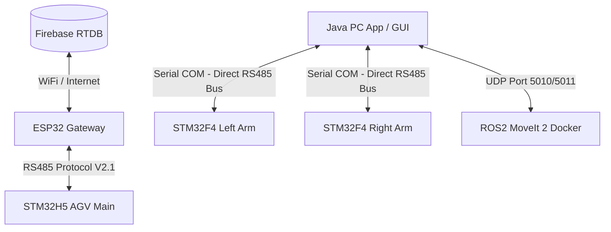

# TÀI LIỆU THUYẾT MINH & ĐẶC TẢ KỸ THUẬT HỆ THỐNG
## XE TỰ HÀNH AGV TÍCH HỢP CÁNH TAY ROBOT KÉP (DUAL-ARM HYBRID AGV SYSTEM)

Tài liệu này cung cấp toàn bộ thông tin chi tiết về kiến trúc phần cứng, cấu trúc phần mềm, giao thức truyền thông và hướng dẫn điều khiển của hệ thống xe tự hành AGV kết hợp hai cánh tay robot 6 trục (Dual-Arm). Hệ thống được thiết kế theo tiêu chuẩn công nghiệp nhằm phục vụ các tác vụ vận chuyển, gắp nhả vật tư tự động trong nhà máy thông minh.

---

## 1. TỔNG QUAN HỆ THỐNG (SYSTEM OVERVIEW)

Hệ thống được thiết kế dưới dạng kiến trúc phân tán (distributed architecture), bao gồm các phân hệ độc lập:
1. **Xe tự hành AGV**: Di chuyển bám vạch từ (Magnetic Line Following), định vị tọa độ bằng camera quét mã QR ngã tư (QR50) và la bàn điện tử (IMU), tự động tìm đường đi ngắn nhất bằng thuật toán Dijkstra.
2. **Cánh tay robot kép (Left & Right 6-DOF Arms)**: Hai cánh tay robot 6 trục đối xứng đảm nhận nhiệm vụ gắp nhả vật thể.
3. **Kiến trúc kết nối trực tiếp (Direct Communication Link)**:
   * **Xe AGV**: Trạng thái và điều khiển di chuyển được đồng bộ qua cổng RS485 Protocol V2.1 giữa **STM32H5 AGV Main** và **ESP32 Gateway** (để truyền lên cơ sở dữ liệu Firebase Realtime Database hoặc PC).
   * **Cánh tay Robot**: Ứng dụng **Java PC App** kết nối trực tiếp với 2 cánh tay robot qua cổng Serial (sử dụng bộ chuyển đổi USB-to-RS485 dùng chung một bus vật lý) bằng giao thức dạng Text có Checksum. Luồng dữ liệu điều khiển tay robot đi thẳng từ PC tới hai mạch điều khiển cánh tay (STM32F4) mà không thông qua bất kỳ bộ điều phối trung gian nào (như STM32H5 hay ESP32).
   * **Hoạch định quỹ đạo**: Bộ lập trình quỹ đạo MoveIt 2 (chạy trong Docker) nhận yêu cầu tọa độ XYZ từ Java PC App qua UDP port 5010 và trả về chuỗi quỹ đạo khớp qua UDP port 5011.



---

## 2. KIẾN TRÚC PHẦN CỨNG (HARDWARE ARCHITECTURE)

### 2.1. Phân Hệ Điều Khiển Di Chuyển AGV
* **Bo Mạch PLC-TVB-AIOT-STM32H5XX**: Tích hợp vi xử lý **STM32H563ZIT6** (ARM Cortex-M33, 250 MHz) đảm nhiệm bám vạch từ, đọc mã QR và rẽ ngã tư.
* **Gateway ESP32**: Đọc cảm biến định vị góc quay **IMU BNO055** và khoảng cách cản **VL53L5CX ToF** qua bus I2C, đồng thời giữ kết nối mạng đồng bộ với Firebase.

### 2.2. Phân Hệ Cánh Tay Robot Kép (Left & Right Arms)
* **Mạch điều khiển Arm Slave (STM32F446VET6)**: Mỗi cánh tay robot sở hữu một vi điều khiển STM32F446VET6 riêng biệt để xuất xung điều khiển Servo và đọc Encoder phản hồi vị trí.
* **Kết nối vật lý**: Cả hai cánh tay cùng kết nối chung vào bus truyền thông RS485 nối trực tiếp về PC. Máy tính PC sử dụng 1 cổng COM vật lý duy nhất (qua đầu chuyển USB-to-RS485) để gửi dữ liệu dạng Text cho cả hai tay. Hai tay robot phân biệt lệnh dành cho mình dựa vào tiền tố `R:` (Right) hoặc `L:` (Left).
* **Bộ kẹp vật thể (Gripper)**: Sử dụng cảm biến dòng điện kết hợp bộ chuyển đổi ADC 12-bit trên STM32F4. Khi kẹp vật thể, dòng điện động cơ tăng làm điện áp ADC thay đổi, giúp điều khiển vòng kín lực kẹp (Force Control) và tự động dừng kẹp khi đạt ngưỡng an toàn để tránh quá tải hoặc làm hỏng vật thể.

---

## 3. KIẾN TRÚC PHẦN MỀM & FIRMWARE (SOFTWARE & FIRMWARE)

### 3.1. Firmware Cánh Tay Robot (STM32F4 Arm Slave)
* **Ngắt Nhận UART (HAL_UART_RxCpltCallback)**:
  Vi xử lý USART2 nhận dữ liệu byte-by-byte từ bus RS485 và tích lũy vào bộ đệm `rx_buffer` cho đến khi gặp ký tự ngắt dòng `\n` hoặc `\r`.
* **Cơ chế xử lý gói tin Text & Checksum**:
  1. Parser tìm ký tự `*` trong chuỗi để chia làm 2 phần: chuỗi dữ liệu lệnh và chuỗi ký tự checksum (ví dụ: `5A`).
  2. Thực hiện tính toán XOR Checksum của toàn bộ ký tự trong chuỗi dữ liệu trước dấu `*`.
  3. Đối chiếu mã checksum vừa tính với mã checksum nhận được (quét qua hàm `sscanf(checksum_str, "%2X", &rx_sum)`). Nếu khớp mới xử lý tiếp, ngược lại tăng biến đếm lỗi `dbg_rx_crc++` và hủy gói tin.
  4. Bộ lọc tiền tố: Mạch tay Trái chỉ nhận chuỗi bắt đầu bằng `L:`, mạch tay Phải chỉ nhận chuỗi bắt đầu bằng `R:`. Gói tin không đúng tiền tố sẽ bị bỏ qua (`dbg_rx_bad_prefix++`).
* **Hàm chuyển đổi góc vật lý**:
  Các góc khớp logic được dịch thành góc quay servo thực tế bằng các công thức tuyến tính đã được hiệu chỉnh cơ khí:
  * Khớp 1: $Servo_0 = -q_1 + 96.43^\circ$
  * Khớp 2: $Servo_1 = -q_2 + 90.00^\circ$
  * Khớp 3: $Servo_2 = q_3 + 35.00^\circ$
  * Khớp 4: $Servo_3 = 65.00^\circ - q_4$
  * Khớp 5: $Servo_4 = -q_5 + 90.00^\circ$
  * Khớp 6 (Kẹp): $Servo_5 = gripper\_angle$ (Điều khiển kẹp dừng kẹp tự động khi ADC feedback đạt giới hạn lực)

> [!NOTE]
> **Lưu ý về Protocol V2.1 nhị phân trên Arm Slave:**
> Trong mã nguồn của STM32F4, mặc dù tiêu đề `arm_protocol.h` định nghĩa cấu trúc frame nhị phân Protocol V2.1 và hàm xử lý `ARM_Proto_ProcessFrame` (cùng cơ chế Δθ guard tương ứng) đã được viết sẵn làm mã tham chiếu dự phòng, nhưng **không được kích hoạt** trong ngắt nhận thực tế. Hệ thống hiện tại vận hành hoàn toàn bằng trình xử lý Text Parser nêu trên để đảm bảo tính trực tiếp và đơn giản của đường truyền.

### 3.2. Firmware AGV Main (STM32H5)
* **7 chế độ vận hành (AGV Run Modes)**:
  1. `MODE_1_LINE_ONLY`: Chỉ bám vạch từ PID, bỏ qua ngã tư và QR. Dùng để cấu hình Kp, Ki, Kd.
  2. `MODE_2_LINE_INTERSECTION`: Bám vạch và dừng phanh cứng khi chạm mắt rìa ngã tư để đo cơ khí.
  3. `MODE_3_TEST_SENSORS_NO_MOTOR`: Ngắt động cơ, chạy thuật toán định tuyến để đẩy xe bằng tay test cảm biến.
  4. `MODE_4_FULL_RUN`: Tự động hoàn toàn (Dijkstra + Đọc QR + Rẽ ngã tư + Truyền thông).
  5. `MODE_5_CALIBRATE_MOTORS`: Chạy tiến/lùi/rẽ theo chu kỳ thời gian để căn chỉnh phần cứng bánh xe.
  6. `MODE_6_TEST_TURN_RIGHT`: Chạy bám vạch, cứ gặp ngã tư bất kỳ là tự động rẽ phải.
  7. `MODE_7_DYNAMIC_TRAJECTORY` (**Quỹ đạo động từ Firebase**): Khi nhận tọa độ đích mới từ Firebase qua ESP32, xe tính lại lộ trình bằng thuật toán Dijkstra và "nối" lệnh bẻ lái trực tiếp tại ngã tư tiếp theo mà không cần dừng xe lại.
* **Thuật toán bám vạch & bẻ lái**: Thuật toán PID kiểm soát góc lệch vạch từ kết hợp định vị hướng rẽ bằng la bàn số IMU qua bộ đọc kiểm tra `AGV_ValidateHeading()`.

### 3.3. Ứng Dụng Java PC App (Swing GUI)
* **Gửi dữ liệu tay robot trực tiếp**:
  Ứng dụng quản lý kết nối COM thông qua `UartManager` bằng thư viện `jSerialComm`. Khi góc khớp của tay robot thay đổi (từ thanh trượt FK hoặc bộ giải động học ngược IK), hàm `sendJointsToUart(boolean forceSend)` trong class `MainFrame` sẽ chuyển đổi các góc sang không gian cơ cấu chấp hành tương đối so với vị trí Home (`toHomeRelativeActuatorSpace`), định dạng thành chuỗi ký tự Text, tính toán XOR checksum và truyền thẳng xuống cổng COM:
  ```java
  // Trích đoạn logic tạo khung truyền Text của tay phải
  String textFrame = String.format(java.util.Locale.US, "R:%d,%d,%d,%d,%d,%d",
      (int) Math.round(qActuator[0] * 100.0),
      (int) Math.round(qActuator[1] * 100.0),
      (int) Math.round(qActuator[2] * 100.0),
      (int) Math.round(qActuator[3] * 100.0),
      (int) Math.round(qActuator[4] * 100.0),
      (int) Math.round(qActuator[5] * 100.0));
  String frameWithChecksum = addChecksum(textFrame);
  uartManager.sendData(frameWithChecksum);
  ```
* **Bộ giải Động học Ngược JNI (C++ Solver via JNI)**:
  Để giải phương trình động học ngược (IK) cho cánh tay 6 bậc tự do trong thời gian thực tại tần số 50Hz, ứng dụng sử dụng thư viện động liên kết C++ (`kinematics_jni.dll` trên Windows hoặc `libkinematics_jni.so` trên Ubuntu) qua giao tiếp Java Native Interface (JNI). Bộ giải số học C++ này cho tốc độ tính toán nhanh gấp hàng trăm lần so với viết bằng Java thuần, đảm bảo quỹ đạo TCP (Tool Center Point) chuyển động trơn tru.
* **Hỗ trợ tay cầm điều khiển PS5**: Tích hợp mã nguồn Python phụ trợ sử dụng thư viện `pygame` để ánh xạ các nút nhấn và cần gạt trên tay cầm PS5 thành lệnh di chuyển XYZ và góc quay của gripper.

### 3.4. Hệ Thống ROS2 & MoveIt 2 (Docker Container)
* **Ràng buộc hướng kẹp (Orientation Constraints)**: Trong file hoạch định `moveit_planner.cpp`, thuật toán lập quỹ đạo tích hợp ràng buộc hướng (Orientation Constraint) cho gripper của tay phải và tay trái để khóa chặt góc Pitch và Roll (sai số cho phép $< 2.8^\circ$), đảm bảo vật phẩm kẹp luôn thẳng đứng khi di chuyển.
* **Cầu nối Java-UDP Bridge (`java_udp_bridge.py`)**: Lắng nghe các gói tin JSON chứa tọa độ đích XYZ từ Java App gửi qua cổng UDP `5010`, chuyển tiếp vào topic `/agv_arm/plan_requests` của ROS2, nhận quỹ đạo MoveIt đã tính toán và gửi phản hồi ngược lại Java App qua cổng UDP `5011`.

---

## 4. GIAO THỨC TRUYỀN THÔNG (COMMUNICATION PROTOCOLS)

Mạng truyền thông của hệ thống được chia làm 2 giao thức riêng biệt:

### 4.1. Giao Thức Điều Khiển Cánh Tay Robot (PC $\rightarrow$ Arms)
Sử dụng định dạng chuỗi ký tự mã hóa Text truyền trên đường bus RS485 tốc độ **115200 bps**.

#### 4.1.1. Lệnh Góc Khớp (Joint Command Frame)
* **Cú pháp**: `[Tiền_tố][dq0],[dq1],[dq2],[dq3],[dq4],[dq5]*[XOR_Checksum]\n`
* **Ý nghĩa thành phần**:
  * `Tiền_tố`: `R:` dành cho tay phải, `L:` dành cho tay trái.
  * `dq0` đến `dq5`: Góc lệch tương đối của 6 khớp so với vị trí Home cơ khí, biểu diễn bằng giá trị góc thực nhân với 100 và làm tròn thành số nguyên (`độ * 100`).
  * `*`: Ký tự phân tách dữ liệu và mã kiểm lỗi checksum.
  * `XOR_Checksum`: 2 ký tự hệ Hex (viết hoa) là kết quả phép XOR từng byte của toàn bộ chuỗi ký tự đứng trước dấu `*`.
  * `\n`: Ký tự xuống dòng đánh dấu kết thúc frame truyền.
* **Ví dụ thực tế**: `R:0,0,1000,-3000,0,0*5A\n`

#### 4.1.2. Lệnh Bộ Kẹp (Gripper Command Frame)
Bộ kẹp vật thể được điều khiển đóng mở trực tiếp bằng các chuỗi lệnh không cần tham số góc khớp:
* `R:GRIP` hoặc `L:GRIP`: Đóng kẹp tay phải / tay trái (kích hoạt trạng thái kẹp dòng đóng).
* `R:RELEASE` hoặc `L:RELEASE`: Mở kẹp tay phải / tay trái.
*(Có thể truyền kèm mã checksum tùy chọn hoặc kiểm tra chuỗi tĩnh trực tiếp trong firmware)*.

### 4.2. Giao Thức Di Chuyển AGV (ESP32 $\leftrightarrow$ STM32H5 Main)
Sử dụng giao thức nhị phân **Protocol V2.1** truyền trên đường truyền UART nội bộ xe tự hành:
* **Cơ chế**: Gói tin nhị phân tối ưu hóa Little-Endian có độ dài payload linh hoạt và bảo vệ bằng mã CRC-16/CCITT-FALSE.
* **Cấu trúc**: `[0xAA][0x55][DEST][SRC][LEN_L][LEN_H][CMD][SEQ][PAYLOAD...][CRC_L][CRC_H]`.

---

## 5. HƯỚNG DẪN VẬN HÀNH & ĐIỀU KHIỂN (OPERATING & CONTROL GUIDE)

### 5.1. Kết Nối Thiết Bị
1. Cắm bộ chuyển đổi **USB-to-RS485** từ máy tính PC điều khiển vào đường bus RS485 nối trực tiếp đến hai cánh tay robot (STM32F4).
2. Bật nguồn cấp cho hệ thống xe tự hành và cánh tay robot.
3. Trên máy tính PC, kiểm tra cổng COM nhận được của bộ chuyển đổi (ví dụ: `COM3` trên Windows hoặc `/dev/ttyUSB0` trên Linux).

### 5.2. Khởi Chạy Và Kết Nối Trên Java PC App
1. Khởi động ứng dụng bằng file `run.bat` hoặc `./run.sh`.
2. Trên thanh menu hoặc bảng điều khiển kết nối, chọn đúng tên cổng COM của USB-to-RS485.
3. Thiết lập tốc độ Baudrate là **115200**.
4. Nhấn **Connect**. Khi kết nối thành công, ứng dụng sẽ bắt đầu truyền các chuỗi lệnh text bám sát sự thay đổi thanh trượt góc khớp (FK) hoặc tọa độ XYZ (IK).

### 5.3. Sử Dụng Tay Cầm PS5 & Hoạch Định Quỹ Đạo ROS2
* Chạy mã nguồn Python `scripts/requirements.txt` và khởi chạy kịch bản ánh xạ nút tay cầm để điều khiển tay qua cổng COM trực tiếp.
* Khởi động Docker Compose để kết nối với MoveIt 2 lập kế hoạch quỹ đạo không va chạm, gửi nhận dữ liệu tọa độ qua UDP nội bộ máy tính trước khi chuyển đổi thành chuỗi lệnh text truyền ra cổng COM.
