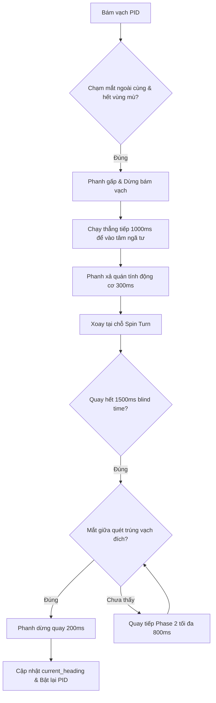

# Tài liệu Kỹ thuật Dự án AGV STM32H5

Tài liệu này tổng hợp toàn bộ logic điều khiển, tham số cấu hình, và cấu trúc bản đồ của AGV để phục vụ việc bảo trì và phát triển. Việc loại bỏ các comment rác trong mã nguồn giúp code sạch hơn, mọi chi tiết giải thích được tập trung tại đây.

---

## 1. Các Chế độ Chạy của Xe (`agv_run_mode`)

Hệ thống phân chia thành 7 chế độ chính để phục vụ quá trình test từng phân đoạn và chạy thực tế:

| Chế độ | Tên Enum | Mô tả chi tiết |
| :--- | :--- | :--- |
| **MODE 1** | `MODE_1_LINE_ONLY` | Chỉ bám vạch PID liên tục, bỏ qua hoàn toàn tất cả các loại ngã tư. |
| **MODE 2** | `MODE_2_LINE_INTERSECTION` | Chạy bám vạch, gặp ngã tư sẽ phanh cứng lại và đứng im mãi mãi (không rẽ). |
| **MODE 3** | `MODE_3_TEST_SENSORS_NO_MOTOR` | Chế độ an toàn: Đọc cảm biến vạch, quét LED debug nhưng **khóa hoàn toàn Motor** không cho chạy. |
| **MODE 4** | `MODE_4_FULL_RUN` | Chạy thực tế tự động: Tích hợp định tuyến Dijkstra + Camera đọc mã QR ở mỗi ngã tư để tự động rẽ về đích. |
| **MODE 5** | `MODE_5_CALIBRATE_MOTORS` | Chạy tiến/lùi/rẽ liên tục theo thời gian cấu hình sẵn để đo đạc và tinh chỉnh thông số cơ khí. |
| **MODE 6** | `MODE_6_TEST_TURN_RIGHT` | Chạy bám vạch, cứ gặp ngã tư bất kỳ là tự động rẽ phải rồi đi tiếp. |
| **MODE 7** | `MODE_7_DEBUG_NO_QR` | **Chế độ Debug định tuyến động**: Nhận điểm đích từ màn hình HMI qua Modbus (địa chỉ 4x_5). Tự động tính toán đường đi bằng thuật toán Dijkstra, kiểm tra hướng để quay xe tại chỗ nếu cần, và tự động bám vạch chạy tới đích. Giả lập mã QR kế tiếp khi chạm ngã tư mà không cần camera quét mã QR. |

---

## 2. Giải thuật Dò Vạch và Điều khiển PID

### Thuật toán Dò vạch (`AGV_FollowLine` & `AGV_GetLineError`)
- **Cảm biến**: 16 mắt đọc hồng ngoại (mạch Pull-up, trả về `0` khi thấy vạch trắng, `1` khi gặp nền đen).
- **Mã hóa lệch vạch**: Chuyển đổi trạng thái nhị phân của 16 mắt đọc thành giá trị sai lệch `current_error` từ `-4.0` (lệch trái tối đa) đến `+4.0` (lệch phải tối đa). `0.0` nghĩa là xe đang nằm chính giữa vạch.
- **Điều khiển PID**:
  - Tần số ngắt PID điều khiển động cơ: Mỗi **10ms** (sử dụng ngắt timer `TIM6`).
  - Tín hiệu sai lệch được truyền qua bộ tính toán PID với công thức chuẩn hóa:
    $$\text{Output} = (K_p \cdot e) + (K_d \cdot d) + (K_i \cdot i)$$
  - Tốc độ bánh trái: $v_L = v_{base} - \text{Output}$
  - Tốc độ bánh phải: $v_R = v_{base} + \text{Output}$
  - Tốc độ cơ sở ($v_{base}$): `300`. Tốc độ giới hạn tối đa: `999` (Xung PWM tối đa của Timer).
- **Hệ số PID dò vạch hiện tại**:
  - `Kp = 85.0f`: Phản hồi nhanh để nắn xe vào giữa vạch.
  - `Kd = 0.5f`: Giảm hiện tượng lắc đuôi (bù trừ quán tính).
  - `Ki = 0.0f`: Không sử dụng khâu tích phân để tránh tích lũy sai số gây vọt lố.

---

## 3. Logic Xử lý Ngã tư và Động học Rẽ (Spin Turn)

Quy trình xử lý ngã tư của xe được cấu trúc chặt chẽ để chống nhiễu cơ khí và quán tính:

### Các Thông số Cấu hình Động học (Calib trong `main.c`)
- **Tốc độ quay (`calib_speed = 150`)**: Quay chậm để cảm biến quét vạch không bị văng lố.
- **Thời gian bù vào tâm (`1000ms`)**: Chạy mù thẳng lên phía trước sau khi phát hiện ngã tư để đưa tâm quay của trục bánh sau trùng khớp với tâm ngã tư khi bẻ lái Trái/Phải.
- **Thủ thuật K-Turn (Quay nhiều đỏ) cho góc 180 độ**: Đối với quay đầu 180 độ ở hành lang hẹp/chân tường, vì tâm quay nằm ở bánh sau nên phần mũi xe quét bán kính rất lớn và dễ đập tường bên phải. Do đó, xe áp dụng thuật toán K-Turn: **(1) Quay mù 45 độ sang phải -> (2) Chạy lùi lại 1000ms -> (3) Quay tiếp 135 độ còn lại để dò vạch**. Việc quay xiên 45 độ rồi mới lùi giúp kéo toàn bộ xe về hướng Tây Nam, nhờ đó khi quay phần mũi xe né được cả bức tường phía trước mặt lẫn bức tường nằm bên phải. Xoay xong, xe sẽ đáp lại đúng vạch từ cũ để chạy tiếp. Đây là giải pháp phần mềm triệt để cho vấn đề cơ khí của xe Differential Drive trong ngõ hẹp.
- **Thời gian phanh tiêu tán quán tính (`300ms`)**: Giúp xe dừng hẳn trước khi quay, bảo vệ mạch công suất động cơ khỏi dòng điện ngược (back EMF).
- **Xoay tại chỗ (Spin Turn)**: Xoay 2 pha. Pha 1 (kick-start) cấp PWM 700 trong 80ms để thắng lực ma sát tĩnh. Pha 2 quay chậm bằng `calib_speed`.
- **Thời gian mù khi quay (`1500ms`)**: Trong 1.5 giây đầu tiên khi đang xoay, xe bỏ qua hoàn toàn các tín hiệu cảm biến để tránh nhận nhầm chính cái vạch dọc mà xe vừa đi qua.
- **Thời gian quay 180 độ (`calib_time_turn_180 = 6200`)**: Cấu hình thời gian cụ thể để hoàn thành góc xoay 180 độ.
- **Phase 2 (Quay tìm vạch - Timeout 800ms)**: Nếu quay hết thời gian dự kiến (`calib_time_turn_90` hoặc `calib_time_turn_180`) mà chưa chạm vạch, xe sẽ tiếp tục quay chậm thêm tối đa 800ms nữa để dò tìm vạch đích.
- **Vùng mù sau ngã tư (`800ms`)**: Sau khi hoàn thành rẽ và bật lại chế độ bám vạch, xe sẽ khóa chức năng phát hiện ngã tư trong vòng 800ms để không bị nhận diện nhầm ngã tư cũ vừa đi qua. Mọi cờ `last_leave_intersection_time` sẽ được reset ngay khi HMI gửi lệnh Start hoặc khi tự động chạy.
- **Bảo vệ mất vạch (Lost Line Protection)**: Nếu xe bị mất vạch hoàn toàn (`0xFFFF` hoặc `0x0000`) liên tục quá **1000ms**, hệ thống tự động ngắt động cơ dừng khẩn cấp để tránh đâm va.

---

## 4. Cấu trúc Bản đồ (Map) và Định tuyến Dijkstra

Bản đồ nhà xưởng được mô hình hóa dưới dạng Danh sách kề (Adjacency List) để tiết kiệm tài nguyên RAM cho MCU:

### Quy ước Tọa độ địa lý
- **Bắc (HEAD_NORTH = 0)**: Hướng tăng số hàng dọc (ví dụ N00 -> N01 -> N02).
- **Đông (HEAD_EAST = 1)**: Hướng đi sang phải (tăng cột ngang).
- **Nam (HEAD_SOUTH = 2)**: Hướng giảm số hàng dọc.
- **Tây (HEAD_WEST = 3)**: Hướng đi sang trái (giảm cột ngang).

### Bản đồ thử nghiệm hiện tại (15 Nodes: N00 đến N14)
- **Cột dọc**: Gồm 5 cột dọc song song song (Cột 0 đến Cột 4), mỗi cột có 3 nodes liên kết dọc với nhau.
- **Đường ngang**: Chỉ có 1 đường ngang duy nhất kết nối các node trên cùng (`N02 <-> N05 <-> N08 <-> N11 <-> N14`).
  - Để chạy từ `N00` (giữa N00 và N01) tới `N11`, xe sẽ đi theo lộ trình: `N00 -> N01 -> N02 -> (Rẽ Phải sang Đông) -> N05 -> N08 -> N11 (Đích)`.

---

## 5. Kiến trúc Dữ liệu và An toàn (Refactoring)

Để giải quyết các vấn đề về biến toàn cục (global variables) phân mảnh và rủi ro race condition, hệ thống đã được refactor với các tiêu chuẩn sau:

### Gom nhóm Biến Trạng thái và Cấu hình
- **`AGV_State_t agv_state`**: Lưu trữ toàn bộ các biến trạng thái runtime của xe (`run_mode`, `indicator_state`, `is_at_intersection`, `current_node`, `destination_node`, v.v.).
- **`AGV_Config_t agv_config`**: Lưu trữ các thông số cấu hình và thời gian xoay (`time_forward`, `time_turn_90`, `turn_speed`, v.v.) thay cho các "magic numbers" rải rác.
- **Lợi ích**: Code dễ bảo trì hơn, giảm thiểu khai báo `extern volatile` lộn xộn trong nhiều file.

### An toàn Dữ liệu ESP32 (Chống Race Condition)
- Dữ liệu IMU và cảm biến siêu âm từ mạch ESP32 được nhận qua UART DMA liên tục vào struct `esp32_data`.
- Hàm **`ESP32_GetSafeData()`**: Sử dụng lệnh khóa ngắt (`__disable_irq()`) để copy toàn bộ struct sang một biến tạm trước khi xử lý, ngăn chặn hoàn toàn hiện tượng xé rách dữ liệu (Tearing) khi ngắt UART xảy ra giữa chừng.

### Logic Tránh Vật Cản (Collision Avoidance)
- Cảm biến khoảng cách (đọc từ ESP32) chỉ kích hoạt phanh khẩn cấp khi xe **đang đi thẳng** (`fabs(current_error) <= 1.5f`).
- Khi xe đang đi vào đoạn cua hoặc lắc đuôi để dò vạch (`current_error` > 1.5), cảm biến siêu âm có thể bị văng chéo và vô tình bắt trúng bức tường nằm bên hông. Do đó, logic đã được cải tiến để bỏ qua các khoảng cách báo ảo này trong lúc xe đang đánh lái mạnh.

### Clamping Duty Cycle Động Cơ
- Hàm `Motor_SetSpeed` được bổ sung giới hạn phần cứng cứng ngắc (`MOTOR_MAX_DUTY = 999`).
- Mọi giá trị tốc độ tính toán từ PID hoặc cấu hình thủ công đều bị cắt (clamp) về ngưỡng an toàn này để tránh tràn bộ đếm Timer (gây ra hiện tượng khựng hoặc đảo chiều không mong muốn do tràn số).
