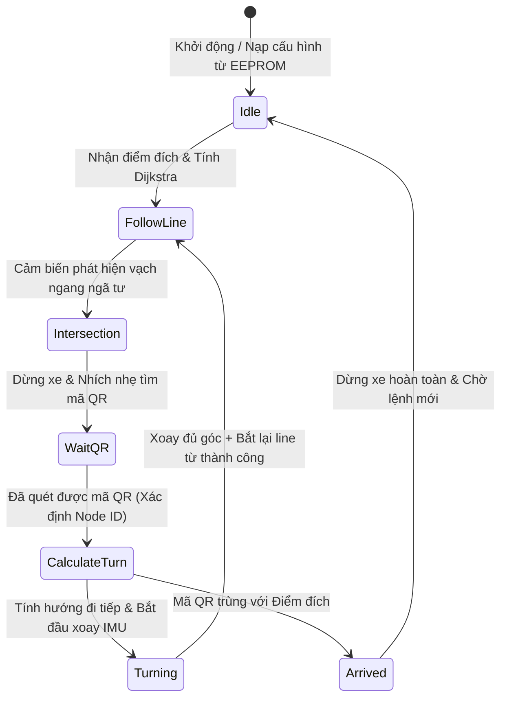

# KIẾN TRÚC MÃ NGUỒN VÀ CHI TIẾT THUẬT TOÁN XE TỰ HÀNH AGV
*(AGV Control Firmware Architecture & Mathematical Algorithms)*

Tài liệu này thuyết minh chi tiết về cấu trúc phần mềm, ý tưởng thiết kế cốt lõi và các thuật toán toán học/logic được lập trình trong hệ thống điều khiển xe tự hành AGV. Đây là tài liệu kỹ thuật giúp lập trình viên, kỹ sư hệ thống hoặc quản lý hiểu sâu về bản chất vận hành của robot từ góc độ mã nguồn.

---

## 1. TỔ CHỨC MÔ-ĐUN MÃ NGUỒN (SOFTWARE ARCHITECTURE)

Hệ thống điều khiển được thiết kế theo dạng **hướng đối tượng hóa trong ngôn ngữ C (Modular C Design)**, chia nhỏ thành các lớp xử lý (HAL Wrapper, Lớp cảm biến, Lớp thuật toán và Máy trạng thái chính):

```
agv_firmware/
├── Core/Inc/ & Core/Src/
│   ├── main.c           : Máy trạng thái chính (Main Loop State Machine), điều phối tổng thể.
│   ├── agv_control.c    : Điều khiển chuyển động (PID bám line, Xoay IMU, Ramping tốc độ).
│   ├── agv_routing.c    : Thuật toán Dijkstra, biểu diễn đồ thị bản đồ số (Factory Map).
│   ├── motor.c          : Lớp trừu tượng động cơ (xuất xung PWM, điều hướng DIR, bảo vệ quá dòng).
│   ├── sensor.c         : Lớp quét phần cứng cảm biến từ 16 mắt đọc bằng GPIO.
│   ├── qr50_reader.c    : Trình phân tích chuỗi dữ liệu (Parser) từ Camera quét mã QR50.
│   └── esp32_hub.c      : Giao thức truyền thông nhị phân Protocol V2.1 với ESP32 Gateway.
```

---

## 2. Ý TƯỞNG CỐT LÕI & MÁY TRẠNG THÁI (STATE MACHINE)

### 2.1. Ý tưởng thiết kế kết hợp (Sensor Fusion)
Để khắc phục nhược điểm của từng cảm biến đơn lẻ:
* **Băng từ** giúp xe đi cực kỳ thẳng và mượt trên đường dẫn, nhưng không cho xe biết mình đang đứng ở đâu (thiếu định vị toàn cục).
* **Mã QR** xác định chính xác tọa độ nút giao lộ, nhưng giữa hai nút giao lộ xe hoàn toàn mù thông tin vị trí.
* **La bàn IMU** giúp định hướng xoay xe tại ngã tư cực tốt, nhưng bị trôi góc (drift) theo thời gian.

**Giải pháp**: 
* Dùng **Bám vạch từ (PID)** để di chuyển dọc đường.
* Dùng **Mã QR** làm mốc reset tọa độ thực tế và reset sai số vị trí tích lũy.
* Dùng **IMU** để xoay cua chính xác tại ngã tư, và ngay khi xoay được $70\% - 80\%$ góc cua thì bật chế độ **Dò tìm line từ động** để tự bắt vào đường dẫn mới. Cách này giúp triệt tiêu hoàn toàn sai số trôi góc của IMU.

### 2.2. Máy trạng thái chính (Main Loop State Machine)
Luồng chạy của xe trong `main.c` được điều phối bởi các biến trạng thái trong cấu trúc `AGV_State_t`:



---

## 3. PHÂN TÍCH CHI TIẾT CÁC THUẬT TOÁN (ALGORITHMS DETAIL)

### 3.1. Thuật toán bám vạch từ bằng bộ điều khiển PID (Line Following PID)

#### Bước 1: Trích xuất sai số lệch tâm (Line Error Calculation)
Thanh cảm biến từ gồm 16 mắt đọc quang điện (trả về giá trị logic `0` khi có từ tính, `1` khi không có từ tính). Hàm `LineSensor_Read()` ghép 16 chân GPIO thành một biến số nguyên `uint16_t` 16-bit (ví dụ `0xFC3F` hay nhị phân `1111 1100 0011 1111`).

Hàm `AGV_GetLineError()` ánh xạ các bit nhị phân này sang giá trị sai số số thực `current_error` từ $-4.0$ (lệch hẳn sang trái) đến $+4.0$ (lệch hẳn sang phải). Vị trí cân bằng lý tưởng ở giữa trả về `0.0`.
*Nếu mất vạch hoàn toàn (đọc ra `0xFFFF` hoặc `0x0000`), hệ thống giữ lại sai số cũ gần nhất để xe tiếp tục lướt theo hướng cũ, tránh mất phương hướng đột ngột.*

#### Bước 2: Công thức tính toán PID điều khiển
Bộ điều khiển PID liên tục tính toán tín hiệu đầu ra ở tần số 100Hz ($\Delta t = 0.01\text{s}$) trong hàm `AGV_ComputePID()`:

$$\text{error}_k = \text{setpoint} - \text{current\_val}_k \quad (\text{với setpoint} = 0.0)$$

$$\text{Integral}_k = \text{Integral}_{k-1} + \text{error}_k \times \Delta t$$

$$\text{Derivative}_k = \frac{\text{error}_k - \text{error}_{k-1}}{\Delta t}$$

$$\text{Output}_k = K_p \times \text{error}_k + K_i \times \text{Integral}_k + K_d \times \text{Derivative}_k$$

*Trong code thực tế:*
* Hệ số tối ưu: $K_p = 65.0$, $K_i = 0.0$, $K_d = 1.5$.
* Việc đặt $K_i = 0.0$ giúp triệt tiêu hiện tượng vọt lố (overshoot) tích lũy khi xe lắc lư nhanh.

#### Bước 3: Phân phối tốc độ tới hai động cơ
Để xe cua bám vạch mượt mà, tín hiệu điều khiển `Output` được cộng/trừ vào tốc độ cơ sở (`current_speed`):

$$\text{Tốc độ bánh Trái } (Speed_L) = \text{current\_speed} - \text{Output}$$

$$\text{Tốc độ bánh Phải } (Speed_R) = \text{current\_speed} + \text{Output}$$

* **Gia tốc mềm (Speed Ramping)**: Để tránh xe bị giật, trượt bánh cơ khí làm lệch hướng la bàn, tốc độ cơ sở không tăng vọt ngay lập tức lên tốc độ mục tiêu (`base_speed`) mà tăng dần đều theo bước gia tốc:
  $$\text{current\_speed}_{k} = \text{current\_speed}_{k-1} \pm 2.5 \quad (\text{với tần số 100Hz, xe mất 2.4 giây để tăng tốc từ 0 lên 600 PWM})$$

---

### 3.2. Thuật toán Nhận diện Giao lộ Thông minh (Junction Recognition)
**Thách thức**: Khi xe di chuyển nhanh, thân xe bị lắc lư (wobble) khiến các mắt cảm biến ngoài cùng thỉnh thoảng đè vạch ảo, gây nhận diện nhầm ngã tư.
**Thuật toán giải quyết**: Một ngã tư hợp lệ được định nghĩa là **mắt cảm biến biên (mắt trái ngoài cùng hoặc mắt phải ngoài cùng) đè vạch VÀ các mắt ở giữa vẫn đang bám vạch**.

Trong code sử dụng phép toán thao tác bit (bitwise logic):
* Cảm biến biên: `0x8001` (Bit 15 và Bit 0). Nhận diện chạm biên khi: `(line_val & 0x8001) != 0x8001` (do tích cực mức Thấp `0`).
* Cảm biến tâm: `CENTER_MASK = 0x03C0` (Bit 9 đến 6). Nhận diện chạm tâm khi: `(line_val & CENTER_MASK) != CENTER_MASK`.
* **Điều kiện ngã tư**:
  $$\text{IsIntersection} = \big((\text{line\_val} \ \& \ 0x8001) \neq 0x8001\big) \ \text{AND} \ \big((\text{line\_val} \ \& \ \text{CENTER\_MASK}) \neq \text{CENTER\_MASK}\big)$$
* Thêm bộ lọc cooldown: Phải cách ngã tư trước đó tối thiểu 1.0 giây (`AGV_LINE_RECOVERY_TIME = 1000ms`) mới được nhận diện ngã tư mới, tránh việc xe bị dừng lặp lại tại cùng một giao lộ do cảm biến quét chậm.

---

### 3.3. Thuật toán Định tuyến đường đi ngắn nhất (Dijkstra)
Bản đồ nhà máy được số hóa dưới dạng đồ thị có hướng (Directed Graph).
* **Nút (Nodes)**: Là các điểm ngã tư có dán mã QR (`N00` đến `N08`), tối đa hỗ trợ 100 nút.
* **Cạnh (Edges)**: Đường nối giữa 2 nút giao lộ liền kề, chứa:
  * ID của nút đích (`target_node_id`).
  * Trọng số/Khoảng cách (`distance`).
  * Hướng la bàn tuyệt đối để đi tới nút đích này (`heading` nhận giá trị: Bắc=0, Đông=1, Nam=2, Tây=3).

```c
typedef struct {
    uint16_t target_node_id;
    uint16_t distance;
    AGV_Heading_t heading; // HEAD_NORTH, HEAD_EAST, etc.
} Edge_t;
```

Khi nhận yêu cầu di chuyển, xe thực thi hàm `Routing_Dijkstra()`:
1. Tạo mảng khoảng cách `dist` gán bằng Vô cùng (`INF_DIST = 99999`), đặt `dist[start_node] = 0`.
2. Duyệt tìm nút `u` có khoảng cách nhỏ nhất chưa được thăm (`visited`).
3. Cập nhật khoảng cách tới các nút lân cận `v` của `u` nếu đi qua `u` ngắn hơn:
   $$\text{Nếu } \text{dist}[u] + \text{weight}(u, v) < \text{dist}[v] \implies \text{dist}[v] = \text{dist}[u] + \text{weight}(u, v), \ \text{prev}[v] = u$$
4. Lặp lại cho đến khi duyệt hết đồ thị hoặc gặp điểm đích `target_node`.
5. Truy vết ngược từ `target_node` về `start_node` bằng mảng `prev` để sinh ra lộ trình `current_path` và đảo ngược mảng để có thứ tự đi đúng.

---

### 3.4. Thuật toán Xoay cua theo La bàn IMU kết hợp Dò Line động (IMU Turning)

#### Khử lỗi nhảy góc của IMU (Global Yaw Accumulation)
Cảm biến IMU BNO055 trả về góc tuyệt đối từ $0^\circ - 360^\circ$. Khi xe xoay qua mốc biên (ví dụ xoay từ $359^\circ$ qua $0^\circ$), giá trị nhảy đột ngột sẽ làm sai lệch phép tính góc quay của xe.
**Thuật toán tích lũy góc liên tục** trong hàm `AGV_UpdateGlobalYaw()` khử hiện tượng này bằng cách tính sai khác góc $\Delta\theta$ giữa hai lần đọc liên tiếp và bù trừ qua mốc $180^\circ$:

$$\Delta\theta = \theta_{\text{mới}} - \theta_{\text{cũ}}$$

$$\text{Nếu } \Delta\theta > 180^\circ \implies \Delta\theta = \Delta\theta - 360^\circ$$

$$\text{Nếu } \Delta\theta < -180^\circ \implies \Delta\theta = \Delta\theta + 360^\circ$$

$$\theta_{\text{toàn\_cục}} = \theta_{\text{toàn\_cục}} + \Delta\theta$$

Cách tính này giúp góc Yaw toàn cục tăng/giảm liên tục (ví dụ quay 3 vòng góc sẽ đạt $1080^\circ$), giúp tính toán góc quay tương đối cực kỳ đơn giản.

#### Cơ chế Xoay cua thông minh (Turn_IMU_Based)
Khi thực hiện rẽ trái/phải 90° hoặc quay đầu 180°:
1. **Đi mù tiến tới (`AGV_BlindForward`)**: Xe đi thẳng không bám line trong một khoảng thời gian ngắn (ví dụ `1900ms`) để đưa tâm xoay của xe vào đúng tâm của giao lộ.
2. **Kích hoạt quay**: Hai bánh xe quay ngược chiều nhau để tạo mô-men xoay xe tại chỗ.
3. **Dò line động**: Trong quá trình xoay, xe liên tục cập nhật góc yaw toàn cục. Khi góc xoay thực tế đạt đến ngưỡng $\text{search\_ratio} = 70\%$ của góc cua mong muốn (ví dụ rẽ 90° thì bắt đầu dò line từ góc 63°):
   * Xe bắt đầu quét cảm biến từ để tìm vạch trung tâm (`CENTER_MASK`).
   * **Ngắt quay ngay lập tức**: Khi phát hiện vạch từ trung tâm đè mắt đọc, xe dừng quay ngay lập tức và chuyển sang chế độ bám line PID thông thường.
   * Cờ an toàn bảo vệ: Nếu quay quá thời gian timeout (5.5 giây) vẫn không thấy line, xe tự động dừng để tránh quay tròn vô tận.

---

### 3.5. Thuật toán Tính Góc rẽ tương đối (Relative Steering Action)
Để xác định xe phải làm gì tại ngã tư (Đi thẳng, Rẽ trái, Rẽ phải hay Quay đầu), ta không thể dùng hướng tuyệt đối trên bản đồ trực tiếp. Ta cần so sánh **Hướng la bàn tuyệt đối hiện tại của xe** (`current_heading`) và **Hướng tuyệt đối của chặng tiếp theo trong bản đồ** (`target_heading`).

Mã hóa 4 hướng la bàn tuyệt đối thành các số nguyên:
* `0` = Hướng Bắc (HEAD_NORTH)
* `1` = Hướng Đông (HEAD_EAST)
* `2` = Hướng Nam (HEAD_SOUTH)
* `3` = Hướng Tây (HEAD_WEST)

Công thức số dư toán học giúp tính toán hành động rẽ tương đối (`diff`):

$$\text{diff} = (\text{target\_heading} - \text{current\_heading} + 4) \pmod 4$$

Kết quả `diff` được ánh xạ thành hành vi bẻ lái vật lý:
* `diff = 0`: **Đi thẳng** (`ACT_STRAIGHT`) -> Xe lướt qua ngã tư rồi bám line tiếp.
* `diff = 1`: **Rẽ phải 90°** (`ACT_TURN_RIGHT`) -> Xoay theo chiều kim đồng hồ.
* `diff = 3`: **Rẽ trái 90°** (`ACT_TURN_LEFT`) -> Xoay ngược chiều kim đồng hồ.
* `diff = 2`: **Quay đầu 180°** (`ACT_BACKWARD`) -> Xoay 180° để quay lại đường cũ.

```
Ví dụ: Xe đang đi hướng Đông (current_heading = 1). 
Chặng tiếp theo yêu cầu đi hướng Bắc (target_heading = 0).
Tính toán: diff = (0 - 1 + 4) % 4 = 3 (Hành động: Rẽ trái 90°). Kết quả hoàn toàn chính xác!
```

---

## 4. CÁC THUẬT TOÁN AN TOÀN VÀ PHỤC HỒI SỰ CỐ TỰ ĐỘNG

### 4.1. Thuật toán phát hiện và phục hồi khi mất định vị (Kidnapped Robot Algorithm)
* **Ý tưởng**: Nếu xe bị tác động ngoại lực (con người di chuyển xe sang vị trí khác hoặc xe bị trượt bánh nặng làm bỏ qua ngã tư), lộ trình định sẵn sẽ bị sai lệch.
* **Logic xử lý**:
  * Khi quét được mã QR có ID là `read_node_id`.
  * Hệ thống kiểm tra xem nút vừa quét được có trùng với nút tiếp theo kỳ vọng trong lộ trình `current_path[path_index + 1]` hay không.
  * Nếu **Không trùng**:
    1. Thiết lập trạng thái bị bắt cóc: `agv_state.is_kidnapped = true`.
    2. Cập nhật vị trí thực tế hiện tại của xe là nút vừa quét: `agv_state.current_node = read_node_id`.
    3. Ngay lập tức gọi thuật toán **Dijkstra** tính toán lại lộ trình mới từ vị trí hiện tại đến đích:
       `Routing_Dijkstra(&factory_map, read_node_id, destination_node, current_path, &path_length)`
    4. Thiết lập lại con trỏ lộ trình `path_index = 0` và tiếp tục di chuyển theo lộ trình mới mà không cần dừng hoạt động của xe.

### 4.2. Thuật toán nhích tìm mã định vị (Nudge Scan Logic)
* **Ý tưởng**: Đôi khi xe dừng hơi sớm tại ngã tư do quán tính phanh lớn, khiến camera QR nằm lệch ngoài vùng quét của nhãn QR dưới sàn.
* **Logic xử lý**:
  * Khi xe xác định đã chạm giao lộ bằng cảm biến từ (`is_at_intersection = true`) nhưng sau 1.5 giây vẫn chưa đọc được mã QR (`pending_qr_node == 0xFFFF`).
  * Hệ thống tăng biến đếm `nudge_count` và xuất lệnh di chuyển tiến mù cực ngắn (50ms) với tốc độ thấp để xe nhích nhẹ về phía trước:
    `AGV_BlindForward(&h_agv, 50);`
  * Nếu nhích quá 3 lần (`nudge_count >= 3`) vẫn không đọc được mã QR, xe dừng phanh khẩn cấp và nháy LED cảnh báo lỗi để bảo vệ hệ thống khỏi các tình huống lỗi phần cứng camera.
