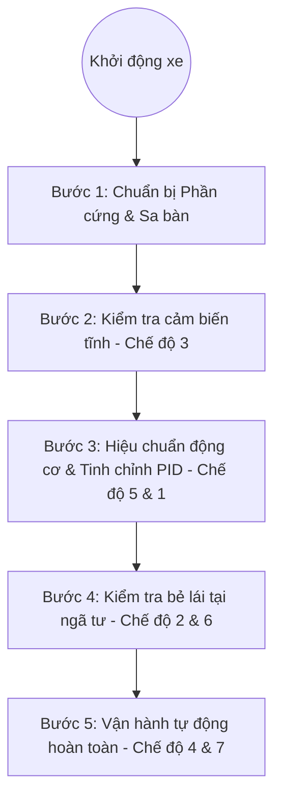

# HƯỚNG DẪN KHỞI ĐỘNG VÀ ĐỊNH VỊ XE TỰ HÀNH AGV
### *(Step-by-Step AGV Startup & Precise Localization Guide)*

Tài liệu này hướng dẫn chi tiết từng bước vận hành xe tự hành AGV từ trạng thái tĩnh, kiểm tra cảm biến, hiệu chuẩn động cơ, cho đến khi xe có thể di chuyển và tự định vị chính xác trên bản đồ nhà máy. Tài liệu được thiết kế trực quan, dễ hiểu cho cả quản lý (sếp), kỹ sư và nhân viên vận hành.

---

## 1. TỔNG QUAN PHƯƠNG PHÁP DI CHUYỂN & ĐỊNH VỊ
Xe tự hành AGV của chúng ta hoạt động theo nguyên lý lai (Hybrid):
1. **Di chuyển bám vạch từ (Magnetic Line Following)**: Xe sử dụng một thanh cảm biến từ 16 mắt để bám theo đường băng keo từ dán dưới sàn bằng thuật toán điều khiển PID.
2. **Định vị tại ngã tư bằng mã QR (QR50 Camera)**: Tại mỗi ngã tư giao lộ, một nhãn mã QR (được mã hóa từ `N00` đến `N08`) được dán dưới sàn. Khi đi qua ngã tư, camera quét mã QR50 đặt dưới gầm xe sẽ nhận dạng mã này để xác định tọa độ hiện tại.
3. **Định hướng bằng La bàn số (IMU BNO055)**: Kết hợp với góc quay tuyệt đối của xe từ cảm biến la bàn điện tử (IMU) để xác định hướng đầu xe (Bắc, Đông, Nam, Tây) và thực hiện bẻ lái chính xác 90° hoặc 180°.
4. **Tìm đường đi ngắn nhất (Dijkstra)**: Khi nhận điểm đích di chuyển, xe tự động tìm lộ trình tối ưu qua các ngã tư bằng thuật toán Dijkstra.

---

## 2. BẢNG TRA CỨU CÁC CHẾ ĐỘ VẬN HÀNH (AGV RUN MODES)
Trong bo mạch điều khiển chính **STM32H5**, chúng ta đã lập trình sẵn 8 chế độ hoạt động phục vụ cho việc kiểm tra và vận hành từng bước:

| Mã Chế Độ | Tên Chế Độ | Mô Tả Hành Vi Của Xe | Mục Đích Sử Dụng |
| :---: | :--- | :--- | :--- |
| **`MODE_1`** | `LINE_ONLY` | Chỉ bám vạch từ PID, bỏ qua hoàn toàn ngã tư và mã QR. | Tinh chỉnh thông số PID bám vạch. |
| **`MODE_2`** | `LINE_INTERSECTION` | Bám vạch từ và phanh dừng cứng (đứng yên vĩnh viễn) tại ngã tư đầu tiên. | Kiểm tra cảm biến nhận diện ngã tư, đo sai số phanh. |
| **`MODE_3`** | `TEST_SENSORS_NO_MOTOR` | Ngắt điện động cơ. Các thuật toán đọc cảm biến từ, camera QR, la bàn IMU vẫn chạy. | Kiểm tra an toàn cảm biến tĩnh bằng cách đẩy xe bằng tay. |
| **`MODE_4`** | `FULL_RUN` | Vận hành tự động hoàn toàn: Bám line + Quét QR ngã tư + Định tuyến Dijkstra tìm đường + Bẻ lái về đích. | Chạy tự động trong sản xuất thực tế. |
| **`MODE_5`** | `CALIBRATE_MOTORS` | Chạy tiến/lùi, rẽ trái, quay đầu theo chu kỳ thời gian định sẵn. | Hiệu chuẩn cơ khí động cơ và thời gian bẻ lái. |
| **`MODE_6`** | `TEST_TURN_RIGHT` | Cứ bám line gặp ngã tư bất kỳ là tự động rẽ phải. | Kiểm tra cơ cấu cua rẽ và khả năng bắt lại line sau rẽ. |
| **`MODE_7`** | `DEBUG_NO_QR` | Chạy bám line và tự động bẻ lái theo quỹ đạo mà không cần camera quét mã QR dưới sàn. | Kiểm tra thuật toán định hướng trong phòng thí nghiệm. |
| **`MODE_8`** | `TEST_ENCODER` | Kiểm tra phản hồi xung từ Encoder của 2 bánh xe. | Chẩn đoán lỗi cơ khí, lệch bánh, mòn lốp. |

---

## 3. CHI TIẾT TỪNG BƯỚC THIẾT LẬP VẬN HÀNH

### BƯỚC 1: Chuẩn bị Phần cứng & Sa bàn (Sa bàn từ và Nhãn QR)
* **Cấp nguồn xe**: Đảm bảo pin/ắc quy đã được sạc đầy. Cấp nguồn DC 24V vào cổng nguồn chính của mạch điều khiển **PLC-TVB-AIOT-STM32H5XX**.
* **Kiểm tra dây kết nối vật lý**:
  * Thanh cảm biến từ (16 mắt) cắm vào nhóm chân đầu vào từ `X0` đến `X15`.
  * Camera quét mã QR50 nối vào cổng UART2 (RS485_1).
  * Bộ ESP32 Gateway kết nối vào UART5 (RS485_2) để đồng bộ dữ liệu cảm biến khoảng cách VL53L5CX, góc la bàn IMU BNO055 và Firebase.
* **Thiết lập sa bàn**:
  * Dán băng keo từ phẳng lên sàn nhà làm đường dẫn.
  * Tại các nút giao cắt (ngã tư), dán mã QR tương ứng hướng đi dưới gầm xe sao cho camera quét đi qua chính diện mã.

---

### BƯỚC 2: Kiểm tra cảm biến tĩnh (An toàn trước khi chạy)
> [!IMPORTANT]
> Bước này bắt buộc phải thực hiện trước khi cho xe tự chạy để phòng ngừa xe mất kiểm soát đâm va vào tường/thiết bị.
1. Cài đặt biến chế độ chạy trong code: `agv_run_mode = MODE_3_TEST_SENSORS_NO_MOTOR`. Ở chế độ này, động cơ bánh xe bị khóa dòng (không quay), đảm bảo xe đứng yên an toàn.
2. **Kiểm tra cảm biến từ**: Đặt xe lên đường băng từ, đẩy nhẹ xe sang trái và sang phải. Quan sát đèn LED trên thanh cảm biến để xác nhận các mắt đọc nhận diện đúng vị trí lệch của xe.
3. **Kiểm tra Camera quét mã QR**: Đẩy xe bằng tay qua một ngã tư có dán mã QR. Quan sát đèn báo trên camera nháy sáng nhận diện thành công và hiển thị mã QR khớp trên màn hình HMI hoặc phần mềm debug (biến `pending_qr_node` nhận dạng đúng số hiệu nút, ví dụ `N01` tương ứng ID `1`).
4. **Kiểm tra cảm biến cản (VL53L5CX)**: Đặt tay hoặc tấm bìa chắn cách đầu xe dưới 500mm, kiểm tra xem xe có kích hoạt trạng thái tạm dừng an toàn hay không. Sau khi rút tay ra, xe phải tự phục hồi trạng thái sẵn sàng.

---

### BƯỚC 3: Hiệu chuẩn động cơ & Tinh chỉnh PID bám vạch
1. **Hiệu chuẩn cơ khí động cơ (MODE_5)**:
   * Chuyển xe sang **`MODE_5_CALIBRATE_MOTORS`** và đặt ở bãi trống.
   * Quan sát xe tự động đi thẳng, lùi, cua rẽ theo thời gian. Nếu xe đi thẳng bị lệch sang một bên, cần điều chỉnh cân bằng cơ khí hoặc kiểm tra hệ số Driver.
2. **Tinh chỉnh PID bám vạch từ (MODE_1)**:
   * Đặt xe lên đường băng từ thẳng và dài. Chuyển sang **`MODE_1_LINE_ONLY`**.
   * Xe sẽ bám theo vạch từ bằng thuật toán PID. Điều chỉnh các hệ số $K_p$, $K_i$, $K_d$ trong code:
     * **$K_p$ (Tỷ lệ)**: Tăng khi xe bám vạch quá chậm hoặc không ôm kịp góc cua. Giảm nếu xe bị giật cục, lắc lư liên tục.
     * **$K_d$ (Vi phân)**: Tăng để giảm dao động lắc lư của xe khi bám line.
   * Đảm bảo xe chạy êm, mượt, giữ tâm xe nằm trùng với đường băng từ ở tốc độ cơ sở (`base_speed = 300.0f`).
   * *Lưu ý*: Xe có tính năng an toàn tự ngắt động cơ sau 10 giây nếu bị lệch hoàn toàn khỏi vạch từ (`lost_line_time > 10000ms`).

---

### BƯỚC 4: Thử nghiệm bẻ lái và phanh ngã tư
1. **Thử nghiệm phanh dừng ngã tư (MODE_2)**:
   * Chuyển sang **`MODE_2_LINE_INTERSECTION`**.
   * Cho xe bám line chạy tiến. Khi xe chạm vạch cắt ngang của ngã tư (các cảm biến rìa trái/phải cùng chạm line từ), xe phải lập tức phanh đứng yên tại chỗ.
   * Đo khoảng cách dừng thực tế xem camera QR có nằm đúng hồng tâm nhãn QR dưới sàn hay không để căn chỉnh thời gian phản hồi phanh.
2. **Thử nghiệm tự động cua rẽ tại ngã tư (MODE_6)**:
   * Chuyển sang **`MODE_6_TEST_TURN_RIGHT`**.
   * Cho xe chạy bám line. Mỗi lần chạm ngã tư, xe phải tự động rẽ phải 90° bằng la bàn IMU:
     * Xe nhích nhẹ qua tâm ngã tư $\rightarrow$ Thực hiện quay phải cho đến khi la bàn IMU báo góc quay thay đổi đủ 90° $\rightarrow$ Kích hoạt lại mắt cảm biến từ để bắt lại line mới và đi tiếp.
     * Kiểm tra xem xe có bị mất line khi quay không. Nếu quay quá đà hoặc chưa tới, cần điều chỉnh tham số góc cua la bàn.

---

### BƯỚC 5: Vận hành tự động hoàn toàn & Định vị chính xác trên Bản đồ
Khi các cảm biến, PID bám line và cơ cấu cua rẽ đã hoạt động hoàn hảo, ta tiến hành cho xe chạy tự động tìm đường trên bản đồ nhà máy:

1. **Khởi chạy bản đồ**: Hàm `Load_Factory_Map()` sẽ nạp sơ đồ 9 nút giao lộ (`N00` đến `N08`) kèm các hướng đi kết nối (Bắc, Đông, Nam, Tây).
2. **Đặt điểm đích**: Trên màn hình HMI hoặc ứng dụng điều khiển, cấu hình nút xuất phát (ví dụ: `N00`) và nút đích đến (ví dụ: `N08`).
3. **Xe tự động tính lộ trình (Dijkstra)**: Xe sẽ tự động tính toán chuỗi ngã tư ngắn nhất cần đi qua, ví dụ lộ trình: `N00 -> N01 -> N02 -> N05 -> N08`.
4. **Quy trình định vị và bẻ lái động tại giao lộ (MODE_4 hoặc MODE_7)**:
   * **Đi trên đường thẳng**: Xe bám vạch từ bằng PID. Hướng đầu xe được theo dõi liên tục bởi la bàn điện tử (`current_heading = HEAD_NORTH`).
   * **Tiếp cận giao lộ**: Khi mắt biên cảm biến từ chạm vạch cắt ngang ngã tư $\rightarrow$ Xe xác nhận đã đến giao lộ (`is_at_intersection = true`).
   * **Quét định vị**: Camera quét nhãn mã QR dưới gầm xe $\rightarrow$ Nhận được mã `'N01'` $\rightarrow$ Bộ điều khiển cập nhật vị trí chính xác hiện tại của xe trên bản đồ số: `current_node = 1`.
   * **Hoạch định hành động rẽ**:
     * Xe tra cứu nút tiếp theo trong lộ trình là `N02`.
     * Tra bản đồ góc hướng cần đi để tới `N02` là hướng Đông (`target_heading = HEAD_EAST`).
     * Tính toán hướng bẻ lái tương đối dựa trên góc lệch la bàn:
       $$\text{diff} = (\text{target\_heading} - \text{current\_heading} + 4) \pmod 4$$
     * Ánh xạ kết quả hiệu số góc ra hành vi di chuyển tương ứng:
       * Lệch $0$ (0°): **Đi thẳng** (`ACT_STRAIGHT`) qua ngã tư.
       * Lệch $1$ (90° bên phải): **Rẽ phải** (`ACT_TURN_RIGHT`) dùng la bàn IMU.
       * Lệch $3$ (90° bên trái): **Rẽ trái** (`ACT_TURN_LEFT`) dùng la bàn IMU.
       * Lệch $2$ (180°): **Quay đầu** (`ACT_BACKWARD`) dùng la bàn IMU.
   * **Chuyển tiếp lộ trình**: Sau khi bẻ lái thành công và bắt lại line từ mới, xe cập nhật hướng đi thực tế mới (`current_heading = target_heading`), chuyển chỉ số lộ trình tiếp theo và tiếp tục di chuyển.
   * **Cập nhật EEPROM an toàn**: Sau mỗi ngã tư qua thành công, vị trí hiện tại và hướng đi của xe được lưu lại vào bộ nhớ Flash EEPROM của vi điều khiển. Trường hợp xe mất nguồn đột ngột, khi khởi động lại xe sẽ tiếp tục hành trình cũ mà không bị mất định vị.
   * **Đến đích**: Khi camera quét được mã QR cuối cùng trùng với `destination_node` (ví dụ `N08`), xe phanh cứng, ngắt bám line và chuyển sang trạng thái chờ lệnh tiếp theo.

---

## 4. CÁC TÍNH NĂNG CHẨN ĐOÁN & TỰ PHỤC HỒI SỰ CỐ
Hệ thống được lập trình sẵn các cơ chế thông minh bảo vệ xe trước các sự cố thường gặp:

1. **Khắc phục lỗi mất vị trí ("Bắt cóc xe" - Kidnapped Robot)**:
   * Nếu nhân viên nhấc xe ra khỏi sa bàn hoặc đặt xe sang một ngã tư khác ngoài lộ trình đã tính toán, ngay khi camera quét được mã QR ở vị trí mới, xe sẽ tự phát hiện vị trí hiện tại sai khác với lộ trình đã lập.
   * Xe lập tức kích hoạt cờ `is_kidnapped = true`, chạy lại thuật toán Dijkstra để tính đường đi mới từ vị trí thực tế hiện tại đến đích và tiếp tục hành trình tự động bình thường mà không dừng báo lỗi.
2. **Dò quét mã QR lỗi (Nudge logic)**:
   * Nếu xe chạm ngã tư nhưng camera QR bị bụi bẩn che khuất chưa đọc được mã QR ngay lập tức, xe sẽ thực hiện "nhích" tiến nhẹ từng khoảng nhỏ 50ms (tối đa 3 lần).
   * Nếu sau 3 lần nhích vẫn không đọc được mã, xe sẽ phanh dừng hẳn và nháy đèn báo lỗi để kỹ thuật viên đến kiểm tra vệ sinh camera.
3. **Tránh vật cản thông minh & lùi sát tường**:
   * Khi cảm biến cản VL53L5CX phát hiện vật cản gần xe sẽ tự dừng chờ vật cản đi qua rồi tự động chạy tiếp.
   * Tại các ngã tư sát tường (trạm sạc, kho hàng), hệ thống tự động bỏ qua cảm biến cản để xe có thể di chuyển áp sát gá kẹp/trạm sạc mà không bị báo lỗi vật cản ảo.
