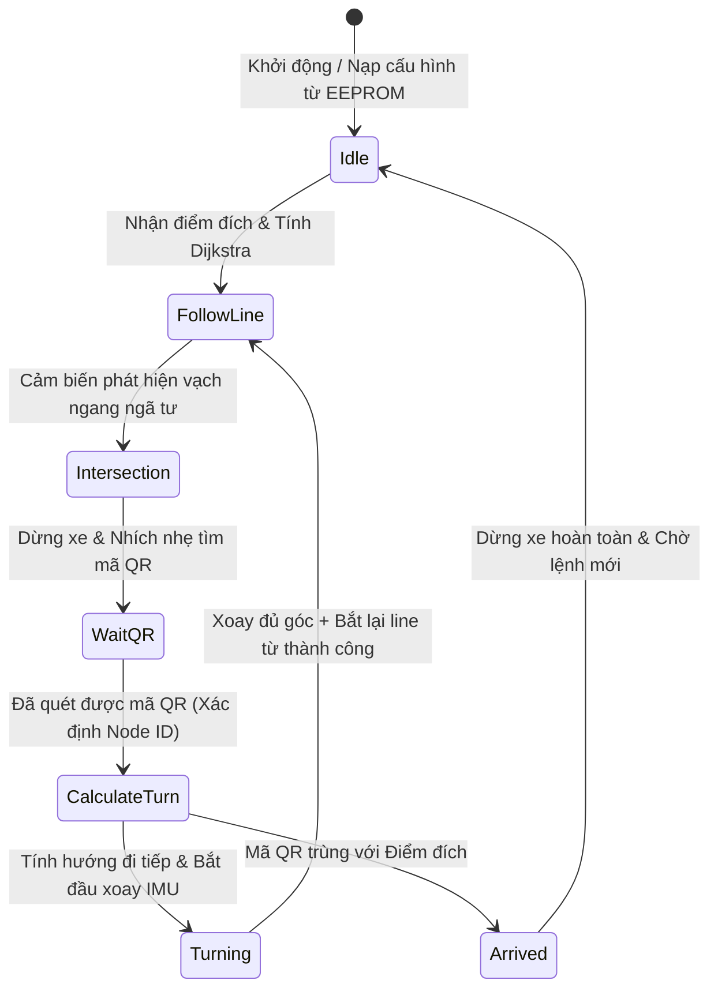

# HƯỚNG DẪN KHỞI ĐỘNG, KIẾN TRÚC CODE VÀ THUẬT TOÁN XE TỰ HÀNH AGV
### *(AGV Startup, Code Architecture & Algorithms Guide)*

Tài liệu này cung cấp toàn bộ thông tin chi tiết từ quy trình vận hành chạy thử xe tự hành AGV thực tế cho đến kiến trúc mã nguồn, ý tưởng thiết kế phần mềm và các thuật toán toán học/logic được lập trình trong hệ thống. Tài liệu được thiết kế trực quan, khoa học để bất kỳ quản lý (sếp), kỹ sư hay nhân viên vận hành nào cũng có thể đọc hiểu.

---

## PHẦN I: KIẾN TRÚC MÃ NGUỒN & Ý TƯỞNG CỐT LÕI

### 1. Tổ Chức Mô-đun Mã Nguồn (Software Modules)
Hệ thống điều khiển chính chạy trên bo mạch **PLC-TVB-AIOT-STM32H5XX** được thiết kế theo dạng **hướng đối tượng hóa trong ngôn ngữ C (Modular C Design)**, chia tách rõ ràng giữa lớp phần cứng (HAL), lớp xử lý cảm biến/động cơ, và lớp thuật toán logic:

```
agv_firmware/
├── Core/Inc/ & Core/Src/
│   ├── main.c           : Máy trạng thái chính (Main Loop State Machine), điều phối tổng thể.
│   ├── agv_control.c    : Điều khiển chuyển động (PID bám line, Xoay IMU, Ramping tốc độ).
│   ├── agv_routing.c    : Thuật toán Dijkstra, biểu diễn đồ thị bản đồ số (Factory Map).
│   ├── motor.c          : Lớp trừu tượng động cơ (xuất xung PWM, điều hướng DIR, bảo vệ quá dòng).
│   ├── sensor.c         : Lớp quét phần cứng cảm biến từ 16 mắt đọc bằng GPIO.
│   ├── qr50_reader.c    : Trình phân tích chuỗi dữ liệu (Parser) từ Camera quét mã QR50.
│   └── esp32_hub.c      : Giao thức truyền thông nhị phân Protocol V2.1 với ESP32 Gateway.
```

---

### 2. Ý Tưởng Thiết Kế Cốt Lõi (Sensor Fusion)
Để khắc phục nhược điểm của từng cảm biến đơn lẻ:
* **Băng từ** giúp xe đi cực kỳ thẳng và mượt trên đường dẫn, nhưng không cho xe biết mình đang đứng ở đâu (thiếu định vị toàn cục).
* **Mã QR** xác định chính xác tọa độ nút giao lộ, nhưng giữa hai nút giao lộ xe hoàn toàn mù thông tin vị trí.
* **La bàn IMU** giúp định hướng xoay xe tại ngã tư cực tốt, nhưng bị trôi góc (drift) theo thời gian.

**Giải pháp**: 
* Dùng **Bám vạch từ (PID)** để di chuyển dọc đường.
* Dùng **Mã QR** làm mốc định vị mốc tọa độ thực tế và reset sai số tích lũy của xe.
* Dùng **IMU** để xoay cua chính xác tại ngã tư. Ngay khi xoay được $70\% - 80\%$ góc cua (`search_ratio`), vi điều khiển bật chế độ **Dò tìm line từ động** để tự bắt vào đường dẫn mới. Cách này giúp triệt tiêu hoàn toàn sai số trôi góc của IMU.

---

### 3. Sơ Đồ Máy Trạng Thái Tổng Thể (State Machine)
Luồng chạy của xe trong `main.c` được điều phối bởi các biến trạng thái trong cấu trúc `AGV_State_t`:



---

## PHẦN II: CHI TIẾT CÁC THUẬT TOÁN ĐIỀU KHIỂN & ĐỊNH VỊ

### 1. Thuật Toán Bám Vạch Từ Bằng PID (Line Following PID)

#### Bước 1: Trích xuất sai số lệch tâm (Line Error Calculation)
Thanh cảm biến từ gồm 16 mắt đọc quang điện (trả về giá trị logic `0` khi phát hiện từ tính, `1` khi không có từ tính). Hàm `LineSensor_Read()` ghép 16 chân GPIO thành một biến số nguyên `uint16_t` 16-bit (ví dụ `0xFC3F` hay nhị phân `1111 1100 0011 1111`).
Hàm `AGV_GetLineError()` ánh xạ các bit nhị phân này sang giá trị sai số số thực `current_error` từ $-4.0$ (lệch hẳn sang trái) đến $+4.0$ (lệch hẳn sang phải). Vị trí cân bằng lý tưởng ở giữa trả về `0.0`.

#### Bước 2: Công thức tính toán PID điều khiển
Bộ điều khiển PID liên tục tính toán tín hiệu đầu ra ở tần số 100Hz ($\Delta t = 0.01\text{s}$) trong hàm `AGV_ComputePID()`:

$$\text{error}_k = \text{setpoint} - \text{current\_val}_k \quad (\text{với setpoint} = 0.0)$$

$$\text{Integral}_k = \text{Integral}_{k-1} + \text{error}_k \times \Delta t$$

$$\text{Derivative}_k = \frac{\text{error}_k - \text{error}_{k-1}}{\Delta t}$$

$$\text{Output}_k = K_p \times \text{error}_k + K_i \times \text{Integral}_k + K_d \times \text{Derivative}_k$$

*Trong code thực tế:*
* Hệ số tối ưu: $K_p = 65.0$, $K_i = 0.0$, $K_d = 1.5$. việc đặt $K_i = 0.0$ giúp triệt tiêu hiện tượng vọt lố (overshoot) tích lũy khi xe lắc lư nhanh.

#### Bước 3: Phân phối tốc độ tới hai động cơ
Tín hiệu điều khiển `Output` được cộng/trừ vào tốc độ cơ sở (`current_speed`) để tạo sai lệch tốc độ bẻ lái:

$$\text{Tốc độ bánh Trái } (Speed_L) = \text{current\_speed} - \text{Output}$$

$$\text{Tốc độ bánh Phải } (Speed_R) = \text{current\_speed} + \text{Output}$$

* **Gia tốc mềm (Speed Ramping)**: Tốc độ cơ sở không tăng vọt ngay lập tức lên tốc độ mục tiêu (`base_speed`) mà tăng dần đều theo bước gia tốc:
  $$\text{current\_speed}_{k} = \text{current\_speed}_{k-1} \pm 2.5 \quad (\text{với tần số 100Hz, xe mất 2.4 giây để tăng tốc từ 0 lên 600 PWM})$$

---

### 2. Thuật Toán Nhận Diện Giao Lộ Tránh Nhiễu (Junction Recognition)
**Thách thức**: Khi xe di chuyển nhanh, thân xe lắc lư khiến mắt ngoài cùng chạm vạch ảo, nhận diện nhầm ngã tư.
**Thuật toán**: Một ngã tư hợp lệ được định nghĩa là **mắt cảm biến biên (mắt trái ngoài cùng hoặc mắt phải ngoài cùng) đè vạch VÀ các mắt ở giữa vẫn đang bám vạch**.

Trong code sử dụng phép toán logic bit:
* Cảm biến biên: `0x8001` (Bit 15 và Bit 0). Nhận diện chạm biên khi: `(line_val & 0x8001) != 0x8001` (tích cực mức thấp `0`).
* Cảm biến tâm: `CENTER_MASK = 0x03C0` (Bit 9 đến 6). Nhận diện chạm tâm khi: `(line_val & CENTER_MASK) != CENTER_MASK`.
* **Điều kiện ngã tư**:
  $$\text{IsIntersection} = \big((\text{line\_val} \ \& \ 0x8001) \neq 0x8001\big) \ \text{AND} \ \big((\text{line\_val} \ \& \ \text{CENTER\_MASK}) \neq \text{CENTER\_MASK}\big)$$
* Thêm bộ lọc thời gian: Phải cách ngã tư trước đó tối thiểu 1.0 giây (`AGV_LINE_RECOVERY_TIME = 1000ms`) mới được nhận diện ngã tư mới, tránh việc xe bị dừng lặp lại tại cùng một giao lộ do cảm biến quét chậm.

---

### 3. Thuật Toán Định Tuyến Tìm Đường Ngắn Nhất (Dijkstra)
Bản đồ nhà máy được số hóa dưới dạng đồ thị có hướng (Directed Graph):
* **Nút (Nodes)**: Là các điểm ngã tư dán mã QR (`N00` đến `N08`), tối đa hỗ trợ 100 nút.
* **Cạnh (Edges)**: Đường nối giữa 2 nút giao lộ liền kề, chứa:
  * ID của nút đích (`target_node_id`).
  * Trọng số/Khoảng cách (`distance`).
  * Hướng la bàn tuyệt đối để đi tới nút đích này (`heading` nhận giá trị: Bắc=0, Đông=1, Nam=2, Tây=3).

Khi nhận yêu cầu di chuyển, xe thực thi hàm `Routing_Dijkstra()`:
1. Tạo mảng khoảng cách `dist` gán bằng Vô cùng (`INF_DIST = 99999`), đặt `dist[start_node] = 0`.
2. Duyệt tìm nút `u` có khoảng cách nhỏ nhất chưa được thăm (`visited`).
3. Cập nhật khoảng cách tới các nút lân cận `v` của `u` nếu đi qua `u` ngắn hơn:
   $$\text{Nếu } \text{dist}[u] + \text{weight}(u, v) < \text{dist}[v] \implies \text{dist}[v] = \text{dist}[u] + \text{weight}(u, v), \ \text{prev}[v] = u$$
4. Lặp lại cho đến khi duyệt hết đồ thị hoặc gặp điểm đích `target_node`.
5. Truy vết ngược từ `target_node` về `start_node` bằng mảng `prev` để sinh ra lộ trình `current_path` và đảo ngược mảng để có thứ tự đi đúng.

---

### 4. Thuật Toán Xoay Cua Theo IMU Kết Hợp Dò Line Động (IMU Turning)

#### Khử lỗi nhảy góc của IMU (Global Yaw Accumulation)
Cảm biến IMU BNO055 trả về góc tuyệt đối từ $0^\circ - 360^\circ$. Khi xe xoay qua mốc biên (ví dụ xoay từ $359^\circ$ qua $0^\circ$), giá trị nhảy đột ngột sẽ làm sai lệch phép tính góc quay của xe.
Hàm `AGV_UpdateGlobalYaw()` tính góc yaw toàn cục tích lũy bằng cách tính sai khác góc $\Delta\theta$ giữa hai lần đọc liên tiếp và bù trừ qua mốc $180^\circ$:

$$\Delta\theta = \theta_{\text{mới}} - \theta_{\text{cũ}}$$

$$\text{Nếu } \Delta\theta > 180^\circ \implies \Delta\theta = \Delta\theta - 360^\circ$$

$$\text{Nếu } \Delta\theta < -180^\circ \implies \Delta\theta = \Delta\theta + 360^\circ$$

$$\theta_{\text{toàn\_cục}} = \theta_{\text{toàn\_cục}} + \Delta\theta$$

#### Cơ chế Xoay cua thông minh (Turn_IMU_Based)
Khi thực hiện rẽ trái/phải 90° hoặc quay đầu 180°:
1. **Đi mù tiến tới (`AGV_BlindForward`)**: Xe đi thẳng không bám line trong một khoảng thời gian ngắn (ví dụ `1900ms`) để đưa tâm xoay của xe vào đúng tâm của giao lộ.
2. **Kích hoạt quay**: Hai bánh xe quay ngược chiều nhau để tạo mô-men xoay xe tại chỗ.
3. **Dò line động**: Trong quá trình xoay, xe liên tục cập nhật góc yaw toàn cục. Khi góc xoay thực tế đạt đến ngưỡng $\text{search\_ratio} = 70\%$ của góc cua mong muốn (ví dụ rẽ 90° thì bắt đầu dò line từ góc 63°):
   * Xe bắt đầu quét cảm biến từ để tìm vạch trung tâm (`CENTER_MASK`).
   * **Ngắt quay ngay lập tức**: Khi phát hiện vạch từ trung tâm đè mắt đọc, xe dừng quay ngay lập tức và chuyển sang chế độ bám line PID thông thường.
   * Cờ an toàn bảo vệ: Nếu quay quá thời gian timeout (5.5 giây) vẫn không thấy line, xe tự động dừng để tránh quay tròn vô tận.

---

### 5. Thuật Toán Tính Góc Rẽ Tương Đối (Relative Steering Action)
Để xác định xe phải làm gì tại ngã tư (Đi thẳng, Rẽ trái, Rẽ phải hay Quay đầu), ta so sánh **Hướng la bàn tuyệt đối hiện tại của xe** (`current_heading`) và **Hướng tuyệt đối của chặng tiếp theo trong bản đồ** (`target_heading`).

Mã hóa 4 hướng la bàn tuyệt đối thành các số nguyên:
* `0` = Hướng Bắc (HEAD_NORTH)
* `1` = Hướng Đông (HEAD_EAST)
* `2` = Hướng Nam (HEAD_SOUTH)
* `3` = Hướng Tây (HEAD_WEST)

Công thức số dư toán học giúp tính toán hành động rẽ tương đối (`diff`):

$$\text{diff} = (\text{target\_heading} - \text{current\_heading} + 4) \pmod 4$$

Kết quả `diff` được ánh xạ thành hành vi bẻ lái vật lý:
* `diff = 0`: **Đi thẳng** (`ACT_STRAIGHT`) -> Xe lướt qua ngã tư rồi bám line tiếp.
* `diff = 1`: **Rẽ phải 90°** (`ACT_TURN_RIGHT`) -> Xoay theo chiều kim đồng hồ.
* `diff = 3`: **Rẽ trái 90°** (`ACT_TURN_LEFT`) -> Xoay ngược chiều kim đồng hồ.
* `diff = 2`: **Quay đầu 180°** (`ACT_BACKWARD`) -> Xoay 180° để quay lại đường cũ.

---

## PHẦN III: HƯỚNG DẪN TỪNG BƯỚC KHỞI ĐỘNG & VẬN HÀNH THỰC TẾ

### 1. Bảng Tra Cứu Các Chế Độ Vận Hành (AGV RUN MODES)
Trong bo mạch điều khiển chính **STM32H5**, chúng ta đã lập trình sẵn 8 chế độ hoạt động phục vụ cho việc kiểm tra và vận hành từng bước:

| Mã Chế Độ | Tên Chế Độ | Mô Tả Hành Vi Của Xe | Mục Đích Sử Dụng |
| :---: | :--- | :--- | :--- |
| **`MODE_1`** | `LINE_ONLY` | Chỉ bám vạch từ PID, bỏ qua hoàn toàn ngã tư và mã QR. | Tinh chỉnh thông số PID bám vạch. |
| **`MODE_2`** | `LINE_INTERSECTION` | Bám vạch từ và phanh dừng cứng (đứng yên vĩnh viễn) tại ngã tư đầu tiên. | Kiểm tra cảm biến nhận diện ngã tư, đo sai số phanh. |
| **`MODE_3`** | `TEST_SENSORS_NO_MOTOR` | Ngắt điện động cơ. Các thuật toán đọc cảm biến từ, camera QR, la bàn IMU vẫn chạy. | Kiểm tra an toàn cảm biến tĩnh bằng cách đẩy xe bằng tay. |
| **`MODE_4`** | `FULL_RUN` | Vận hành tự động hoàn toàn: Bám line + Quét QR ngã tư + Định tuyến Dijkstra tìm đường + Bẻ lái về đích. | Chạy tự động trong sản xuất thực tế. |
| **`MODE_5`** | `CALIBRATE_MOTORS` | Chạy tiến/lùi, rẽ trái, quay đầu theo chu kỳ thời gian định sẵn. | Hiệu chuẩn cơ khí động cơ và thời gian bẻ lái. |
| **`MODE_6`** | `TEST_TURN_RIGHT` | Cứ bám line gặp ngã tư bất kỳ là tự động rẽ phải. | Kiểm tra cơ cấu cua rẽ và khả năng bắt lại line sau rẽ. |
| **`MODE_7`** | `DEBUG_NO_QR` | Chạy bám line và tự động bẻ lái theo quỹ đạo mà không cần camera quét mã QR dưới sàn. | Kiểm tra thuật toán định hướng trong phòng thí nghiệm. |
| **`MODE_8`** | `TEST_ENCODER` | Kiểm tra phản hồi xung từ Encoder của 2 bánh xe. | Chẩn đoán lỗi cơ khí, lệch bánh, mòn lốp. |

---

### 2. Quy Trình Vận Hành 5 Giai Đoạn

#### GIAI ĐOẠN 1: Chuẩn bị Phần cứng & Sa bàn
* **Cấp nguồn**: Cấp nguồn 24V vào bo mạch **PLC-TVB-AIOT-STM32H5XX**. Kiểm tra các LED nguồn 5V, 3.3V sáng đều.
* **Cắm cáp**: Kết nối cảm biến từ (cổng X0-X15), camera QR50 (RS485_1), ESP32 Gateway (RS485_2).
* **Thiết lập sa bàn**: Dán băng keo từ phẳng làm đường dẫn và dán nhãn mã QR (N00-N08) tại các ngã tư.

#### GIAI ĐOẠN 2: Kiểm tra cảm biến tĩnh
> [!IMPORTANT]
> Bước này bắt buộc phải thực hiện trước khi cho xe tự chạy để phòng ngừa xe mất kiểm soát đâm va vào tường/thiết bị.
1. Cài đặt chế độ chạy trong code: `agv_run_mode = MODE_3_TEST_SENSORS_NO_MOTOR`. Ở chế độ này, động cơ bánh xe bị khóa dòng (không quay), đảm bảo xe đứng yên an toàn.
2. **Kiểm tra cảm biến từ**: Đặt xe lên đường băng từ, đẩy nhẹ xe sang trái và sang phải. Quan sát đèn LED trên thanh cảm biến để xác nhận các mắt đọc nhận diện đúng vị trí lệch.
3. **Kiểm tra Camera quét mã QR**: Đẩy xe bằng tay qua một ngã tư có dán mã QR. Quan sát đèn báo trên camera nháy sáng nhận diện thành công và biến `pending_qr_node` nhận dạng đúng số hiệu nút (ví dụ `N01` tương ứng ID `1`).
4. **Kiểm tra cảm biến cản (VL53L5CX)**: Đặt tay chắn cách đầu xe dưới 500mm, kiểm tra xem xe có kích hoạt trạng thái tạm dừng an toàn hay không.

#### GIAI ĐOẠN 3: Hiệu chuẩn động cơ & Tinh chỉnh PID
1. **Hiệu chuẩn cơ khí động cơ (MODE_5)**:
   * Chuyển xe sang **`MODE_5_CALIBRATE_MOTORS`** và đặt ở bãi trống.
   * Nếu xe đi thẳng bị lệch sang một bên, cần điều chỉnh cân bằng cơ khí hoặc kiểm tra hệ số Driver.
2. **Tinh chỉnh PID bám vạch từ (MODE_1)**:
   * Đặt xe lên đường băng từ thẳng và dài. Chuyển sang **`MODE_1_LINE_ONLY`**.
   * Điều chỉnh các hệ số $K_p$ (tăng nếu xe phản ứng chậm, giảm nếu xe lắc lư) và $K_d$ (tăng để giảm dao động lắc lư).
   * Đảm bảo xe chạy êm, mượt, giữ tâm xe nằm trùng với đường băng từ ở tốc độ cơ sở (`base_speed = 300.0f`).

#### GIAI ĐOẠN 4: Thử nghiệm bẻ lái và phanh ngã tư
1. **Thử nghiệm phanh dừng ngã tư (MODE_2)**:
   * Chuyển sang **`MODE_2_LINE_INTERSECTION`**. Cho xe bám line chạy tiến. Khi xe chạm vạch cắt ngang của ngã tư, xe phải lập tức phanh đứng yên tại chỗ.
   * Đo khoảng cách dừng thực tế xem camera QR có nằm đúng hồng tâm nhãn QR dưới sàn hay không để căn chỉnh thời gian phản hồi phanh.
2. **Thử nghiệm tự động cua rẽ tại ngã tư (MODE_6)**:
   * Chuyển sang **`MODE_6_TEST_TURN_RIGHT`**. Cho xe chạy bám line. Mỗi lần chạm ngã tư, xe phải tự động rẽ phải 90° bằng la bàn IMU, bắt lại line mới và đi tiếp.

#### GIAI ĐOẠN 5: Vận hành tự động hoàn toàn & Định vị chính xác trên Bản đồ
1. **Khởi chạy bản đồ**: Hàm `Load_Factory_Map()` nạp sơ đồ 9 nút giao lộ (`N00` đến `N08`) kèm các hướng đi kết nối.
2. **Đặt điểm đích**: Trên màn hình HMI hoặc ứng dụng điều khiển, cấu hình nút xuất phát (ví dụ: `N00`) và nút đích đến (ví dụ: `N08`).
3. **Xe tự động di chuyển**: Xe chạy Dijkstra để lập lộ trình, tự động bám line PID, khi chạm ngã tư sẽ quét mã QR định vị nút hiện tại, tính toán hành động rẽ dựa vào hiệu số hướng la bàn, bẻ lái cua rẽ và tiếp tục hành trình cho đến khi quét được mã QR đích và phanh dừng báo hoàn thành nhiệm vụ.
4. **Cập nhật EEPROM an toàn**: Sau mỗi ngã tư qua thành công, vị trí hiện tại và hướng đi của xe được lưu lại vào bộ nhớ Flash EEPROM. Trường hợp xe mất nguồn đột ngột, khi khởi động lại xe sẽ tiếp tục hành trình cũ.

---

## PHẦN IV: CÁC CƠ CHẾ AN TOÀN & TỰ PHỤC HỒI SỰ CỐ TỰ ĐỘNG

### 1. Thuật toán phát hiện và phục hồi khi mất định vị (Kidnapped Robot)
Nếu xe bị nhấc sang vị trí khác hoặc xe bị trượt bánh nặng làm bỏ qua ngã tư:
* Khi quét được mã QR mới có ID là `read_node_id` không khớp với lộ trình đã lập.
* Xe tự động bật cờ `is_kidnapped = true`, cập nhật `agv_state.current_node = read_node_id`, ngay lập tức gọi lại thuật toán **Dijkstra** tính toán lại lộ trình mới từ vị trí hiện tại đến đích và tiếp tục hành trình tự động bình thường mà không dừng báo lỗi.

### 2. Thuật toán nhích tìm mã định vị (Nudge Scan Logic)
Nếu xe dừng hơi sớm tại ngã tư khiến camera QR nằm lệch ngoài vùng quét của nhãn QR dưới sàn:
* Khi chạm giao lộ bằng cảm biến từ (`is_at_intersection = true`) nhưng sau 1.5 giây vẫn chưa đọc được mã QR (`pending_qr_node == 0xFFFF`).
* Hệ thống thực hiện di chuyển tiến mù cực ngắn (50ms) với tốc độ thấp để xe nhích nhẹ về phía trước (`nudge_count` tối đa 3 lần).
* Nếu quá 3 lần vẫn không đọc được mã, xe phanh dừng khẩn cấp và nháy LED cảnh báo lỗi để bảo vệ hệ thống.

### 3. Tránh vật cản thông minh & lùi sát tường
* Khi cảm biến cản VL53L5CX phát hiện vật cản gần xe sẽ tự dừng chờ vật cản đi qua rồi tự động chạy tiếp.
* Tại các ngã tư sát tường (trạm sạc, kho hàng), hệ thống tự động bỏ qua cảm biến cản để xe có thể di chuyển áp sát gá kẹp/trạm sạc mà không bị báo lỗi vật cản ảo.
