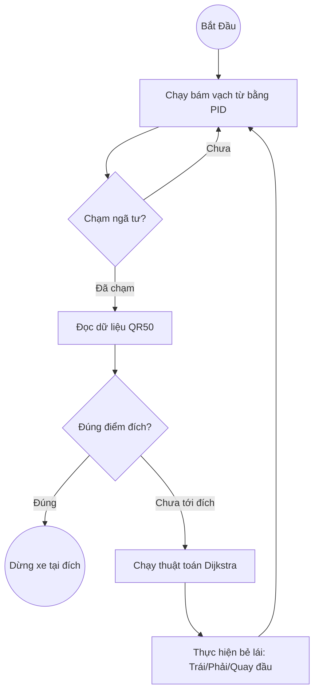

# Firmware AGV & Mạch Điều Khiển PLC-TVB-AIOT-STM32H5XX

Dự án này chứa mã nguồn điều khiển tự động (Firmware) cho xe tự hành AGV (Automated Guided Vehicle), được tối ưu hóa để chạy trên bo mạch công nghiệp **PLC-TVB-AIOT-STM32H5XX**.

---

## 1. Tổng Quan Phần Cứng (Hardware Introduction)
Bo mạch điều khiển này là một module điều khiển và giao tiếp chuẩn công nghiệp, được thiết kế cho các ứng dụng tự động hóa, điều khiển chuyển động (motion control) và thu thập dữ liệu (DAQ). Bo mạch tích hợp vi điều khiển STM32H563ZIT6 mạnh mẽ, các module nguồn cách ly, cổng kết nối I/O đa dạng và kết nối mạng Ethernet.

Thiết kế cách ly điện, độ tin cậy cao và khả năng xử lý thời gian thực giúp bo mạch giao tiếp trực tiếp được với mọi loại cảm biến, cơ cấu chấp hành, động cơ và các hệ thống điều khiển bên ngoài.

### Đặc tả kỹ thuật (Features and Specifications)

| Tính Năng | Thông Số / Mô Tả |
|-----------|------------------|
| **MCU** | STM32H563ZIT6 |
| **Giao tiếp (Interfaces)** | 3x RS485 (Isolate) (Tùy chọn RS485 DB9) 1x RS232 (Isolate) 1x Ethernet RJ45 (W5500) |
| **Nguồn cấp (Power)** | 9-36V/2A (Có cổng xuất 5V Output trên mạch) |
| **I/O Mở rộng** | **38x Input** (PNP / NPN) - cấu hình qua Jumper **24x Output** (Relay) **2x DAC ISO 16bit** (SPI DAC8852) **8x ADC ISO 16bit** (SPI ADS8688) **4x LS7366R** (SPI Encoder) **8x PWM** **3x User LED** |

---

## 2. Bản Đồ Chân Ngoại Vi (Interface Peripheral Mapping)

**Giao tiếp tích hợp sẵn (Built-in):**
* **PWM**: ISO Amplitude 0 - 5V
* **RS485_0 ISO**: (DB9 pin 8, 9) | RX: `PC11` | TX: `PC10`
* **RS485_1 ISO**: RX: `PD6` | TX: `PD5`
* **RS485_2 ISO**: RX: `PD2` | TX: `PC12`
* **RS232 ISO**: RX: `PA10` | TX: `PA9`
* **User LED**: `PD0`, `PF11`, `PF12`

*Lưu ý cổng DB9: RS232 (Tx: pin 3, Rx: pin 2, GND: pin 5) / RS485_0 (A: pin 9, B: pin 8, GND: pin 7 & 6).*

**Giao tiếp bên ngoài (External via SPI):**
* **DAC ISO 16 bit (DAC8852)**: Output 0-10V | CLK: `PG7`, SDI: `PG6`, CS: `PG8`
* **ADC ISO 16 bit (ADS8688)**: Input 0-10V / 0-5V | CLK: `PB13`, SDI: `PB15`, SDO: `PB14`, CS: `PG12`, RST: `PG13`
* **LAN Ethernet (W5500)**: CLK: `PA5`, SDI: `PA7`, SDO: `PA6`, CS: `PC4` *(Lưu ý bản v0.2 đã sửa CS từ PB6 sang PC4)*
* **Encoder 4 trục (LS7366R)**: CLK: `PB3`, SDI: `PB5`, SDO: `PB4` | CS Pins: `PE0`, `PG10`, `PE2`, `PE3`

---

## 3. Chi Tiết Các Cổng Kết Nối (Board Connectors)

### Lớp Dưới (Layer 1 - Bottom)

**Cổng P1 (Outputs):**
| Chân | Tên | Chức Năng (Pin MCU) | Chân | Tên | Chức Năng (Pin MCU) |
|---|---|---|---|---|---|
| 1 | Y23 | Output 23 (`PG2`) | 13 | Y11 | Output 11 (`PC1`) |
| 2 | Y22 | Output 22 (`PG3`) | 14 | Y10 | Output 10 (`PC0`) |
| 3 | Y21 | Output 21 (`PD10`) | 15 | CM2 | COM cho Y10 -> Y13 |
| 4 | Y20 | Output 20 (`PD11`) | 16 | Y7 | Output 7 (`PF10`) |
| 5 | CM4 | COM cho Y20 -> Y23 | 17 | Y6 | Output 6 (`PF9`) |
| 6 | Y17 | Output 17 (`PD9`) | 18 | Y5 | Output 5 (`PF3`) |
| 7 | Y16 | Output 16 (`PF15`) | 19 | Y4 | Output 4 (`PF2`) |
| 8 | Y15 | Output 15 (`PE15`) | 20 | CM1 | COM cho Y0 -> Y7 |
| 9 | Y14 | Output 14 (`PD8`) | 21 | Y3 | Output 3 (`PC13`) |
| 10 | CM3 | COM cho Y14 -> Y17 | 22 | Y2 | Output 2 (`PE7`) |
| 11 | Y13 | Output 13 (`PB0`) | 23 | Y1 | Output 1 (`PE5`) |
| 12 | Y12 | Output 12 (`PC2`) | 24 | Y0 | Output 0 (`PE4`) |

**Cổng P2 & P3 (Inputs & Power):**
*Lưu ý (Jumper J7): Cắm J7 nối CI/CI1 với 24V -> Board nhận NPN (Low active). Rút J7 nối CI/CI1 với 0V -> Board nhận PNP (High active).*

| Chân P2 | Tên | Chức Năng | Chân P3 | Tên | Chức Năng (Pin MCU) |
|---|---|---|---|---|---|
| 1 | IN- | Nguồn GND | 1-8 | X6-X15 | Inputs (`PC3`, `PA0`, `PA1`, `PA2`, `PA3`, `PA4`, `PC5`, `PG1`) |
| 2 | IN+ | Nguồn VCC 9-36V | 9-16 | X16-X25 | Inputs (`PG0`, `PE8`, `PE10`, `PE9`, `PE12`, `PE11`, `PE14`, `PE13`) |
| 3-4 | CI, CI1| COM Input 1 & 2 | 17-24 | X26-X35 | Inputs (`PG4`, `PG5`, `PF14`, `PD4`, `PD3`, `PD7`, `PG15`, `PG14`) |
| 5-10 | X0-X5 | Inputs (`PF1`, `PF4`, `PF5`, `PF6`, `PF7`, `PF8`) |

---

### Lớp Trên (Layer 2 - Top)

| Chân P1 (Encoder) | Chân P2 (Nguồn & RS485) | Chân P3 (PWM & DAC) | Chân P4 (ADC & PWM) |
|---|---|---|---|
| 1-2: CM+ (Anode) | 1-2: 5V Onboard | 1: PW7 (`PC7`) | 1-16: AD0 đến AD7 + IN- GND (ADS8688) |
| 3-4: XC7, XC6 (CH4: B, A) | 3-4: GND Onboard | 2: PW8 (`PC6`) | 17-18: CM- (ADC COM) |
| 5-6: XC5, XC4 (CH3: B, A) | 5: G2 (GND_2) | 3-4: CM1- (PWM COM) | 19: PW1 (`PD15`) |
| 7-8: XC3, XC2 (CH2: B, A) | 6-7: B2, A2 (RS485_2) | 5-6, 9-10: CM2- (DAC COM) | 20: PW2 (`PD14`) |
| 9-10: XC1, XC0 (CH1: B, A)| 8-10: G1, B1, A1 (RS485_1)| 7-8: DA2, DA1 (DAC8852) | 21-24: PW3-PW6 (`PD13`, `PD12`, `PC9`, `PC8`) |

---

## 4. Sơ Đồ Luồng Hoạt Động AGV (Firmware Pipeline)

Đây là vòng lặp trạng thái cốt lõi của xe AGV.

---

## 5. Cấu Trúc Thư Mục & Vai Trò Các File (File Structure)

Hệ thống mã nguồn C được thiết kế theo dạng Module hóa để dễ dàng bảo trì và phát triển:

| File | Chức Năng Chính |
|------|----------------|
| **`main.c / main.h`** | Chứa vòng lặp `while(1)` cốt lõi, State Machine điều phối xử lý ngã tư, khởi tạo phần cứng (HAL), cấu hình bản đồ nhà máy (`Load_Factory_Map`), và tiếp nhận các ngắt DMA UART/Timer. |
| **`agv_control.c / .h`** | Não bộ điều khiển vật lý. Chứa thuật toán tính toán độ lệch line (`AGV_GetLineError`), vòng lặp PID (`AGV_FollowLine`), và các chu trình xử lý bẻ lái ép cứng (`AGV_TurnLeft`, `TurnRight`, `Turn180`). |
| **`agv_routing.c / .h`** | Không gian toán học định tuyến. Quản lý cấu trúc danh sách kề (Adjacency List) của bản đồ, thuật toán Dijkstra tìm đường đi ngắn nhất, và quy đổi hướng la bàn tuyệt đối sang hành vi rẽ tương đối. |
| **`motor.c / .h`** | Lớp trừu tượng (HAL Wrapper) cho động cơ. Cho phép gán tốc độ từ `-999` đến `999`. Tự động gỡ rối tín hiệu bằng cách đảo chân DIR và xuất xung PWM tương ứng. |
| **`sensor.c / .h`** | Chịu trách nhiệm quét 16 chân GPIO của thanh cảm biến từ và ghép lại thành một biến nhị phân 16-bit (ví dụ `0xFC3F`) phục vụ tính sai số cho PID. |
| **`qr50_reader.c / .h`** | Thư viện tách bóc dữ liệu từ mảng raw byte nhận qua giao tiếp RS485 thành định dạng mã QR thuần túy (dạng chuỗi ký tự Nxxx). |
| **`stm32h5xx_it.c`** | Xử lý các ngắt phần cứng (Interrupt Service Routines). Nơi chứa logic reset an toàn con trỏ Circular DMA RS485 bằng lệnh `HAL_UART_AbortReceive()`. |

---

## 6. Hệ Thống 7 Chế Độ Vận Hành (AGV Run Modes)

Để việc test xe trên sa bàn thực tế an toàn và chia nhỏ thành từng bước, firmware được tích hợp 7 chế độ chạy. Bạn có thể thay đổi chế độ bằng cách sửa biến `agv_run_mode` ở đầu file `agv_control.c` trước khi biên dịch:

* **`MODE_1_LINE_ONLY`**: Xe chỉ bám theo vạch từ, lờ đi hoàn toàn tín hiệu ngã tư và mã QR. Phù hợp để tinh chỉnh PID bám vạch.
* **`MODE_2_LINE_INTERSECTION`**: Xe bám vạch và phanh cứng (đứng yên vĩnh viễn) khi mắt rìa chạm ngã tư. Phù hợp để đo đạc sai số cơ khí tại ngã tư.
* **`MODE_3_TEST_SENSORS_NO_MOTOR`**: Động cơ bị ngắt điện hoàn toàn. Các thuật toán định tuyến và đọc QR vẫn chạy bình thường. Phù hợp để đẩy tay qua ngã tư test sensor.
* **`MODE_4_FULL_RUN`**: Chạy tự động toàn diện (Định tuyến Dijkstra + Camera đọc QR ở mỗi ngã tư + Tự động bám vạch).
* **`MODE_5_CALIBRATE_MOTORS`**: Chạy tiến/lùi/rẽ theo chu trình thời gian để calib cơ khí.
* **`MODE_6_TEST_TURN_RIGHT`**: Chạy bám vạch, cứ gặp ngã tư bất kỳ là tự động rẽ phải.
* **`MODE_7_DEBUG_NO_QR`**: **Định tuyến động không cần QR (Mặc định)**. Người dùng nhập điểm đến trên màn hình HMI. Xe tự tính toán Dijkstra, tự động kiểm tra hướng và quay xe (nếu cần), sau đó tự động phóng đi bám vạch tới đích. Các ngã tư trên đường được tự động giả lập đi qua mà không cần camera mã QR quét thực tế.
