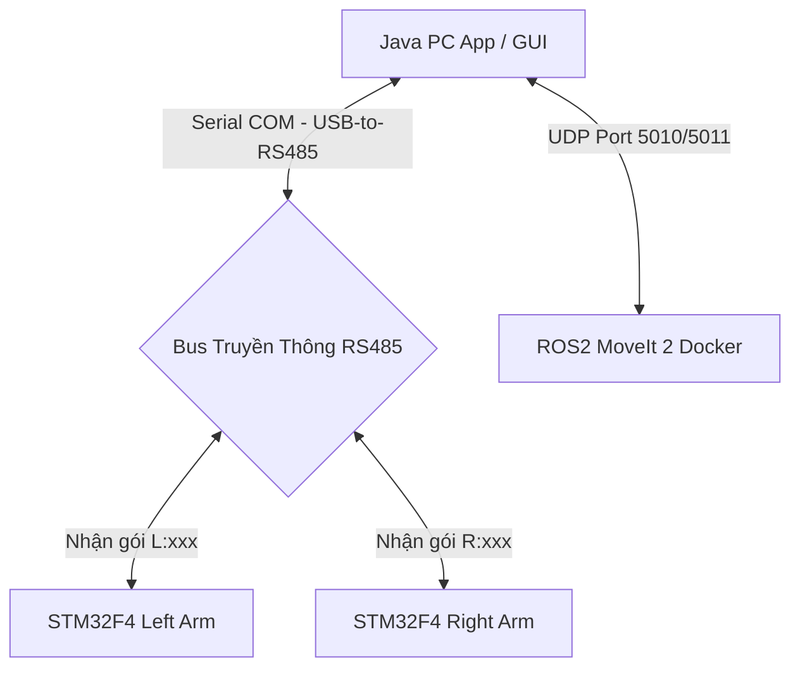
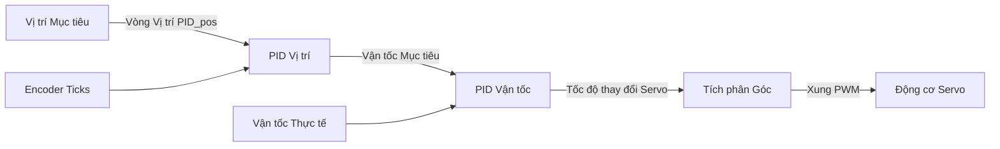

# HƯỚNG DẪN KHỞI ĐỘNG, KIẾN TRÚC CODE VÀ THUẬT TOÁN HỆ THỐNG CÁNH TAY ROBOT KÉP
### *(Dual-Arm System Startup, Code Architecture & Algorithms Guide)*

Tài liệu này cung cấp thông tin chi tiết từ quy trình khởi động hệ thống hai cánh tay robot kép (Left & Right 6-DOF Arms) cho đến thiết kế phần mềm, cấu trúc truyền thông và các thuật toán điều khiển vòng kín chạy trong firmware. Tài liệu được thiết kế trực quan, dễ hiểu cho cả quản lý (sếp), kỹ sư và nhân viên vận hành.

---

## PHẦN I: KIẾN TRÚC HỆ THỐNG & TỔ CHỨC CODE

### 1. Sơ Đồ Kết Nối Hệ Thống (System Topology)
Hệ thống gồm hai cánh tay robot 6 trục đối xứng (Left & Right) được điều khiển độc lập bởi 2 bo mạch xử lý STM32F446VET6 riêng biệt (Arm Slave). Cả hai mạch cùng kết nối chung vào một đường truyền vật lý RS485 dạng bus, nối về máy tính PC thông qua duy nhất một bộ chuyển đổi USB-to-RS485.



* **Phân biệt lệnh**: Cả hai tay robot đều nghe thấy tất cả các dữ liệu truyền từ PC. Tuy nhiên, cánh tay bên trái chỉ thực thi các gói tin có tiền tố `L:`, cánh tay bên phải chỉ thực thi các gói tin có tiền tố `R:`.

---

### 2. Tổ Chức Thư Mục Mã Nguồn (Firmware Directory)
Mã nguồn điều khiển cánh tay robot nằm trong hai thư mục `arm_firmware_left` (cánh tay trái) và `arm_firmware_right` (cánh tay phải). Cả hai dự án có cấu trúc mô-đun tương đương nhau:

```
arm/
├── arm_firmware_left/ & arm_firmware_right/
│   └── Core/Src/
│       ├── main.c           : Khởi chạy ngắt nhận UART, phân tích cú pháp chuỗi điều khiển (Parser).
│       ├── joint_control.c  : Thuật toán điều khiển PID vòng kín Cascade (Vị trí & Vận tốc).
│       ├── servo.c          : Driver điều chế xung PWM (500us - 2500us), quy đổi góc qua tỷ số truyền.
│       ├── encoder.c        : Đọc phản hồi xung góc khớp thực tế từ Encoder.
│       └── pid.c            : Lớp thuật toán PID tổng quát cho vòng lặp điều khiển.
```

---

## PHẦN II: CHI TIẾT CÁC THUẬT TOÁN ĐIỀU KHIỂN & ĐỊNH VẠNG TRUYỀN THÔNG

### 1. Thuật Toán Điều Khiển Vòng Kín Cascade PID (Cascade Position-Velocity Control)
Để đảm bảo cánh tay di chuyển êm ái, bám sát quỹ đạo mà không bị rung giật hoặc quá dòng động cơ, chúng ta áp dụng thuật toán **Cascade PID** (Vòng điều khiển xếp chồng lồng kép) trong `joint_control.c` ở tần số 100Hz ($\Delta t = 0.01\text{s}$):



#### Luồng xử lý chi tiết cho mỗi khớp (Joint):
1. **Đọc phản hồi vị trí**: Hàm `Encoder_Get_Ticks()` đọc giá trị hiện tại của Encoder (đơn vị: Ticks).
2. **Tính toán vận tốc thực tế**: Sử dụng sai phân vị trí chia cho thời gian lấy mẫu $\Delta t$:
   $$Vel_{\text{thực}} = \frac{Pos_{\text{hiện\_tại}} - Pos_{\text{trước\_đó}}}{\Delta t}$$
3. **Vòng điều khiển Vị trí (Vòng ngoài)**: So sánh Vị trí mục tiêu và Vị trí thực tế. Đầu ra của vòng ngoài là Vận tốc mục tiêu ($Vel_{\text{mục\_tiêu}}$):
   $$Vel_{\text{mục\_tiêu}} = K_{p\_pos} \times (Pos_{\text{mục\_tiêu}} - Pos_{\text{thực}})$$
4. **Vòng điều khiển Vận tốc (Vòng trong)**: So sánh Vận tốc mục tiêu với Vận tốc thực tế. Đầu ra là tốc độ thay đổi góc của servo ($Rate_{\text{servo}}$):
   $$Rate_{\text{servo}} = K_{p\_vel} \times (Vel_{\text{mục\_tiêu}} - Vel_{\text{thực}}) + K_{i\_vel} \times \int (Vel_{\text{mục\_tiêu}} - Vel_{\text{thực}}) \, dt$$
5. **Tích phân đầu ra**: Lệnh điều khiển góc servo được tích lũy liên tục để tạo chuyển động mượt mà:
   $$\theta_{\text{servo\_mới}} = \theta_{\text{servo\_cũ}} + Rate_{\text{servo}} \times \Delta t$$
6. **Chống quá đà (Saturation Clamping)**: Góc lệnh điều khiển được giới hạn chặt chẽ theo góc quay vật lý và cấu trúc cơ học của từng khớp (ví dụ khớp có hộp số được chặn từ $0^\circ$ đến $192.86^\circ$ để tránh gãy cơ cấu).

---

### 2. Thuật Toán Phân Tích Chuỗi UART & XOR Checksum (Communication Protocol)
PC gửi lệnh điều khiển xuống dưới dạng chuỗi Text (ASCII) kết thúc bằng ký tự ngắt dòng `\n` hoặc `\r` để dễ dàng gỡ lỗi và chống nhiễu đường truyền.

#### Định dạng khung truyền:
`[Tiền_tố][dq0],[dq1],[dq2],[dq3],[dq4],[dq5]*[XOR_Checksum]\n`
* `Tiền_tố`: `R:` hoặc `L:`
* `dq0` đến `dq5`: Góc khớp mục tiêu tương đối nhân với 100 (`độ * 100`) để loại bỏ dấu phẩy số thực giúp truyền tải nhanh hơn.
* `*`: Ký tự phân tách mã checksum.
* `XOR_Checksum`: 2 ký tự mã Hex viết hoa.

#### Thuật toán tính toán Checksum (XOR Logic):
Mã Checksum là kết quả phép XOR từng byte của chuỗi ký tự đứng trước dấu `*`.
```java
// Phía PC (Java App) sinh Checksum:
private String addChecksum(String str) {
    int sum = 0;
    for (int i = 0; i < str.length(); i++) {
        sum ^= str.charAt(i); // XOR từng ký tự
    }
    return str + "*" + String.format("%02X", sum & 0xFF) + "\n";
}
```
Tại vi điều khiển STM32F4, hàm `HAL_UART_RxCpltCallback` nhận từng ký tự. Khi gặp `\n` hoặc `\r`, nó dừng nhận, tính toán XOR chuỗi ký tự nhận được, so sánh với mã mã Hex sau dấu `*`. Nếu trùng khớp 100% mới tiến hành bóc tách góc và thực thi điều khiển, loại bỏ hoàn toàn các khung truyền bị nhiễu điện áp trên đường truyền RS485.

#### Ánh xạ góc tương đối từ PC sang góc tuyệt đối của Servo:
Do cơ cấu lắp ráp góc của Servo thực tế bị lệch so với mô hình động học Robot, firmware thực hiện ánh xạ tuyến tính trong ngắt nhận:
* Khớp 0: $\theta_{\text{servo}} = -\theta_{\text{khớp}} + 96.43^\circ$
* Khớp 1: $\theta_{\text{servo}} = -\theta_{\text{khớp}} + 90.00^\circ$
* Khớp 2: $\theta_{\text{servo}} = \theta_{\text{khớp}} + 35.00^\circ$
* Khớp 3: $\theta_{\text{servo}} = 65.00^\circ - \theta_{\text{khớp}}$
* Khớp 4: $\theta_{\text{servo}} = -\theta_{\text{khớp}} + 90.00^\circ$
* Khớp 5: $\theta_{\text{servo}} = \theta_{\text{khớp}}$

---

### 3. Thuật Toán Tỷ Lệ Hộp Số Cơ Khí (Gearbox Scaling)
Để nhân mô-men xoắn giúp cánh tay khỏe hơn, các khớp chuyển động sử dụng các bộ truyền bánh răng giảm tốc có tỷ số truyền cơ học đặc biệt. Firmware trong `servo.c` tự động tính toán bù tỷ số truyền trước khi xuất xung PWM:
* **Khớp 0, 1, 2**: Sử dụng hộp số **tỷ số truyền 5:7** (Servo cần xoay 7 độ để khớp xoay 5 độ).
  $$\theta_{\text{servo\_thực}} = \theta_{\text{khớp}} \times \frac{7.0}{5.0}$$
* **Khớp 4, 6**: Sử dụng hộp số **tỷ số truyền 2:3** (Servo cần xoay 3 độ để khớp xoay 2 độ).
  $$\theta_{\text{servo\_thực}} = \theta_{\text{khớp}} \times \frac{3.0}{2.0}$$
* **Khớp 3, 5**: Tỷ lệ 1:1, không đổi góc.

Sau khi quy đổi góc khớp ra góc quay vật lý thực tế của trục Servo, driver ánh xạ tuyến tính sang độ rộng xung PWM cấp cho Servo (500us tương ứng $0^\circ$ và 2500us tương ứng góc tối đa $180^\circ$ hoặc $270^\circ$).

---

### 4. Thuật Thuật Toán Kiểm Soát Lực Kẹp Vật Thể (Force Control Gripper)
Khớp kẹp vật (Gripper) sử dụng động cơ có tích hợp cảm biến dòng điện thông qua ADC 12-bit trên vi điều khiển STM32F4:
1. Khi nhận lệnh đóng kẹp `"R:GRIP"` hoặc `"L:GRIP"`, động cơ kẹp bắt đầu chạy khép lại.
2. Vi điều khiển liên tục đọc giá trị dòng điện động cơ thông qua bộ ADC.
3. Khi ngón kẹp chạm vào vật thể, dòng điện động cơ sẽ tăng vọt do bị kẹt cơ học.
4. Ngay khi giá trị dòng điện ADC vượt quá ngưỡng an toàn được lập trình, hệ thống lập tức dừng động cơ kẹp và chuyển sang trạng thái duy trì lực (Force Hold), tránh làm móp méo hỏng vật thể hoặc cháy cuộn dây của động cơ kẹp.

---

## PHẦN III: HƯỚNG DẪN VẬN HÀNH CHẠY THỬ THỰC TẾ

### Bước 1: Kết Nối Phần Cứng
1. Kết nối bộ nguồn DC 12V-24V cấp điện cho hệ thống hai cánh tay robot và mạch driver logic.
2. Cắm cáp truyền thông RS485 của cả hai mạch cánh tay vào đầu chuyển USB-to-RS485.
3. Cắm đầu USB-to-RS485 vào máy tính PC điều khiển (kiểm tra cổng COM nhận được trên Device Manager hoặc cổng `/dev/ttyUSB0` trên Linux).

### Bước 2: Khởi Chạy Kết Nối Trên Java PC App
1. Khởi chạy ứng dụng PC qua file chạy `./run.sh` hoặc `run.bat`.
2. Chọn đúng cổng COM của USB-to-RS485, đặt tốc độ Baudrate là **115200**.
3. Nhấn **Connect**. Khi kết nối thành công, ứng dụng PC sẽ bắt đầu gửi khung truyền text cập nhật liên tục vị trí thanh trượt góc khớp.

### Bước 3: Đưa Cánh Tay Về Vị Trí Home
1. Trên giao diện ứng dụng PC, thiết lập tất cả các góc khớp 6 trục của hai tay về giá trị `0` độ.
2. Cánh tay sẽ tự động di chuyển về tư thế Home cơ học (tư thế thẳng đứng). Kiểm tra các khớp xem có bị lệch cơ học hay kẹt khớp nào không để điều chỉnh tay gá.

### Bước 4: Chạy Quỹ Đạo Phối Hợp
* **Chế độ kiểm tra tay cầm (PS5 controller)**: Sử dụng các joystick và nút bấm trên tay cầm PS5 để kiểm tra phản hồi tức thời của cánh tay robot.
* **Chế độ tự động hoàn toàn (ROS2 & MoveIt 2)**:
  1. Khởi động Docker Compose chứa ROS2 MoveIt 2.
  2. Ứng dụng Java gửi tọa độ gắp nhả mong muốn XYZ qua UDP port 5010.
  3. MoveIt 2 lập quỹ đạo không va chạm và trả chuỗi các góc khớp qua UDP port 5011.
  4. Java App tiếp nhận chuỗi quỹ đạo và truyền liên tiếp xuống bus RS485 để cánh tay gắp thả vật phẩm nhịp nhàng.
